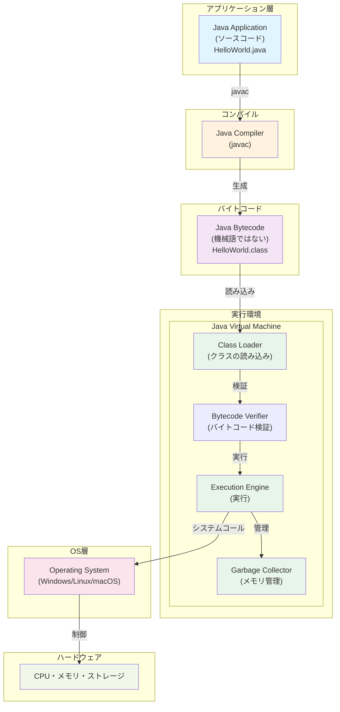
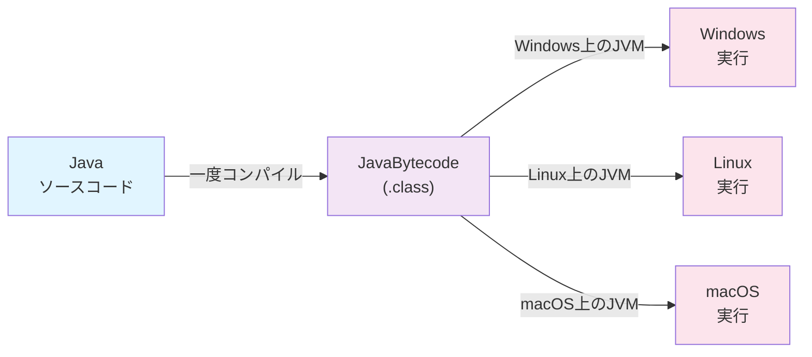
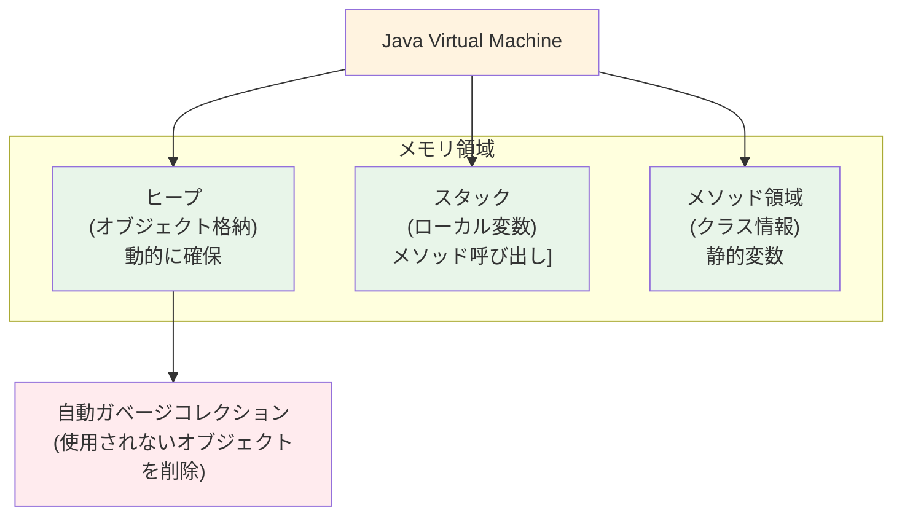
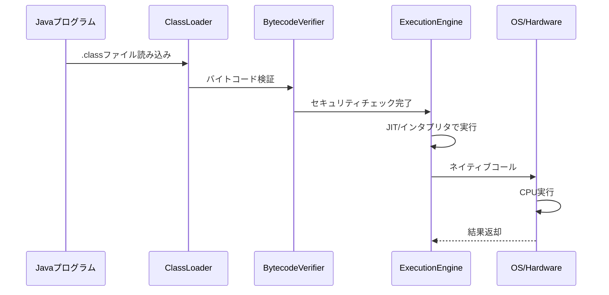
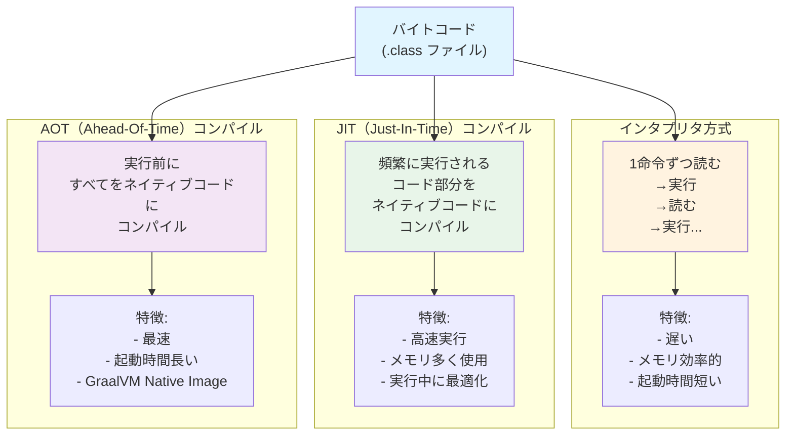
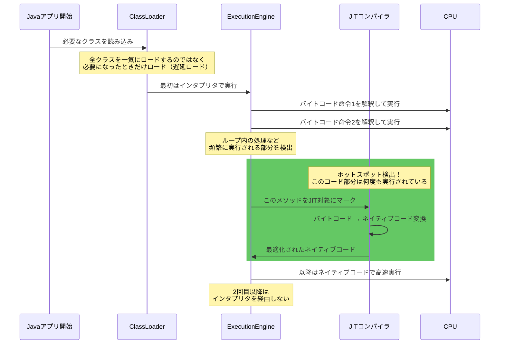

# JavaとJavaVMの関係図



## JavaVMの特徴

### 1. **プラットフォーム独立性（Write Once, Run Anywhere）**


### 2. **JVMのメモリ構造**


### 3. **バイトコード実行フロー**


## JVMの2つの実行方式



## 実際のJVM動作フロー



## 具体例

```
【実行例：ループ処理】

int sum = 0;
for (int i = 0; i < 1000000; i++) {
    sum += i;  // ← この部分が何度も実行される
}

【実行の流れ】
1回目〜数百回: インタプリタで実行（遅い）
          ↓
    ホットスポット検出（この部分は頻繁に実行される）
          ↓
JIT: このループをネイティブコードにコンパイル
          ↓
数百回目以降: ネイティブコードで実行（高速）
```

## 答え：**段階的実行**

1. **クラスロード** - 必要なクラスだけ読み込み（遅延ロード）
2. **初期実行** - インタプリタで命令を逐一読んで実行
3. **ホットスポット検出** - 何度も実行される部分を検出
4. **JIT最適化** - そこをネイティブコードに変換
5. **高速実行** - 以降はネイティブコードで実行

**すべてロードされるわけではなく、すべてJITコンパイルされるわけでもなく、実行パターンに応じて動的に最適化される**のが現代JVMの特徴です。
