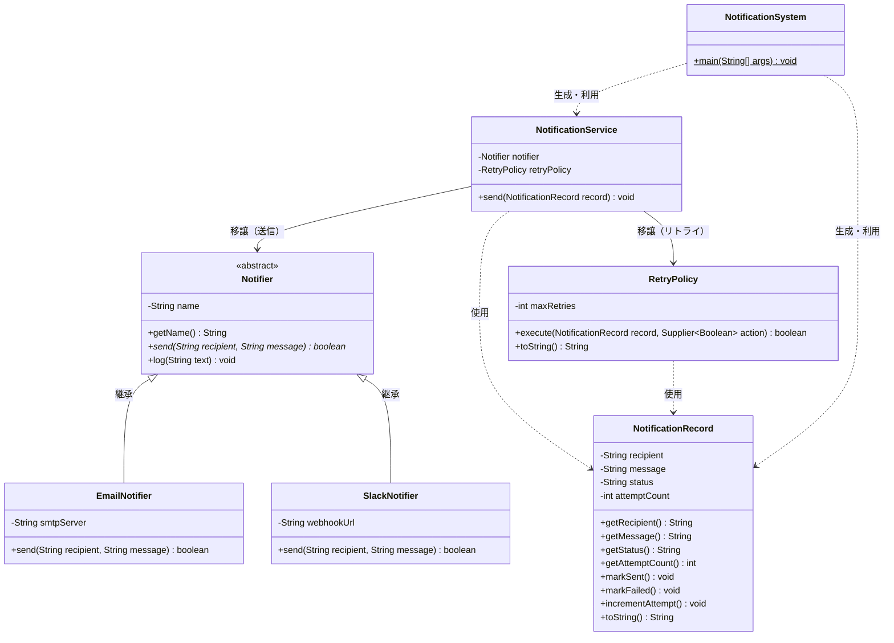

# NotificationSystem クラス図

## OOP概念とクラスの対応

| 概念 | 図中の表現 |
|------|-----------|
| **カプセル化** | `NotificationRecord` の `-` (private) フィールドと `+` (package) メソッドによるアクセス制御 |
| **継承** | `Notifier <\|-- EmailNotifier / SlackNotifier` の実線矢印 |
| **多態** | `Notifier` が `<<abstract>>` で `send()` を抽象メソッドとして定義し、サブクラスが各自実装 |
| **移譲** | `NotificationService --> Notifier / RetryPolicy` の実線矢印（コンポジション） |
