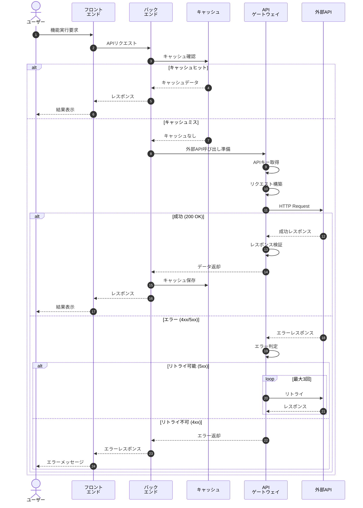
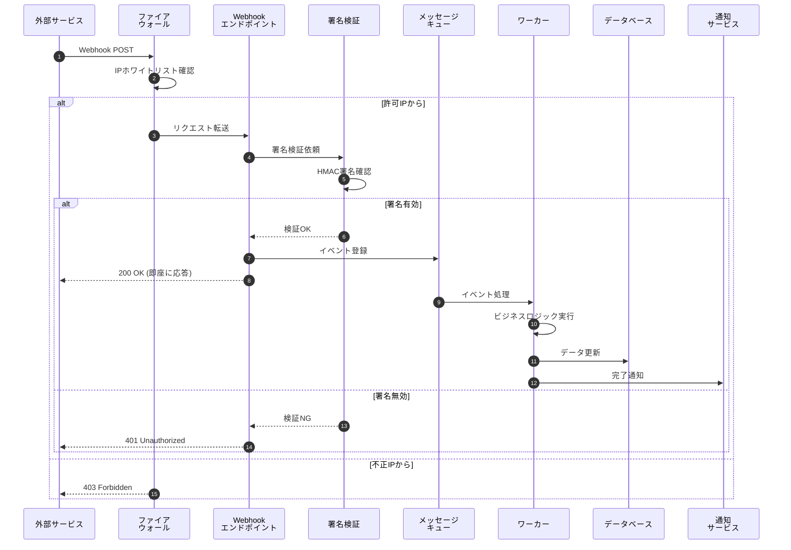
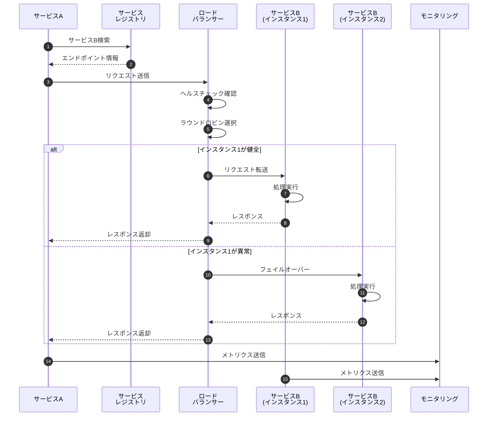
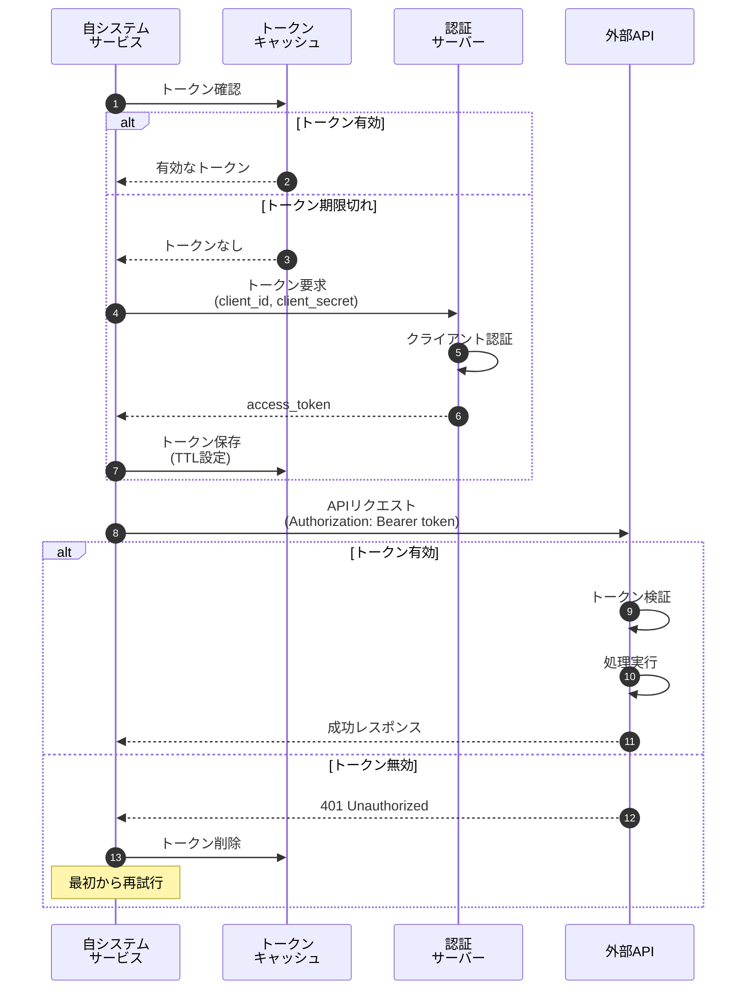

# API連携フロー

## 概要

外部サービスとのAPI連携における標準的なフローを示します。認証、リトライ、エラーハンドリングを含みます。

## 外部API呼び出しフロー



## Webhook受信フロー



## サービス間連携フロー



## API認証フロー (OAuth 2.0 Client Credentials)



## API仕様

### エンドポイント例

```http
GET /api/v1/users/{userId}/profile
Authorization: Bearer {access_token}
Accept: application/json
```

### レスポンス例

```json
{
  "status": "success",
  "data": {
    "userId": "12345",
    "name": "山田太郎",
    "email": "yamada@example.com",
    "createdAt": "2024-01-01T00:00:00Z"
  },
  "metadata": {
    "requestId": "req_abc123",
    "timestamp": "2024-12-17T10:30:00Z"
  }
}
```

## SLA・パフォーマンス指標

| 指標 | 目標値 |
|---|---|
| レスポンスタイム | < 200ms (p95) |
| 可用性 | 99.9% |
| エラー率 | < 0.1% |
| リトライ成功率 | > 95% |

## エラーハンドリング戦略

!!! warning "リトライ戦略"
    - **5xx エラー**: 指数バックオフでリトライ (1秒、2秒、4秒)
    - **429 (Rate Limit)**: Retry-Afterヘッダーに従う
    - **4xx エラー (429以外)**: リトライしない

!!! info "タイムアウト設定"
    - 接続タイムアウト: 5秒
    - 読み取りタイムアウト: 30秒
    - 全体タイムアウト: 60秒

!!! tip "ベストプラクティス"
    - サーキットブレーカーパターンの実装
    - レート制限の遵守
    - 適切なキャッシュ戦略
    - 詳細なログとモニタリング

## 連携先一覧

| サービス名 | 用途 | プロトコル | 認証方式 |
|---|---|---|---|
| 決済サービス | 決済処理 | HTTPS/REST | OAuth 2.0 |
| メール配信 | メール送信 | HTTPS/REST | APIキー |
| SMS送信 | SMS通知 | HTTPS/REST | Basic認証 |
| 地図サービス | 位置情報 | HTTPS/REST | APIキー |
