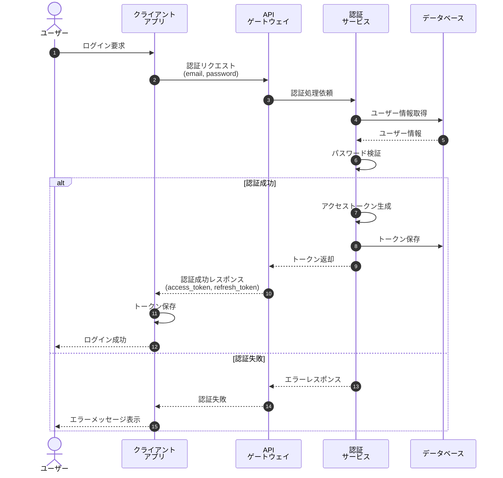
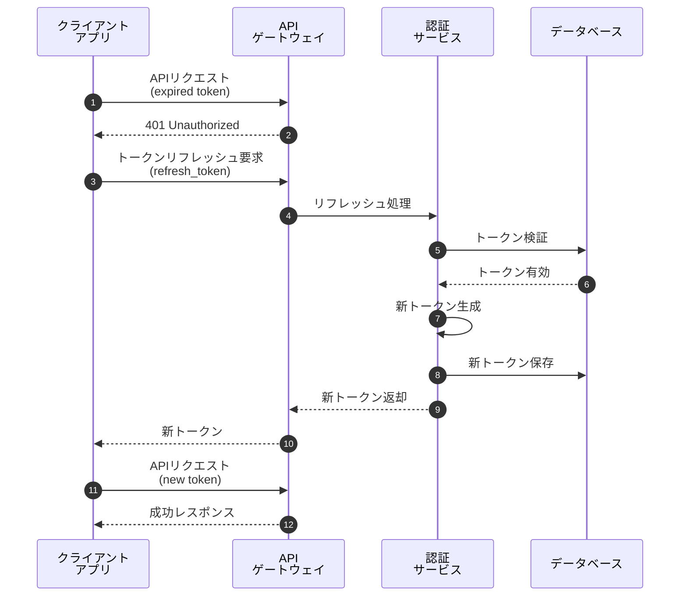

# ユーザー認証フロー

## 概要

OAuth2.0を使用したユーザー認証フローを示します。クライアントアプリケーションが認証サーバーと連携してユーザー認証を行います。

## シーケンス図

### 認証フロー全体



## フロー詳細

### 1. ログイン要求
ユーザーがクライアントアプリケーションでログインフォームに情報を入力します。

### 2-3. 認証リクエスト
クライアントはAPIゲートウェイ経由で認証サービスにリクエストを送信します。

```json
{
  "email": "user@example.com",
  "password": "********"
}
```

### 4-5. ユーザー情報の検証
認証サービスはデータベースからユーザー情報を取得し、パスワードをハッシュ比較で検証します。

### 6-9. トークン生成と返却
認証成功時、JWTトークンを生成してクライアントに返却します。

```json
{
  "access_token": "eyJhbGciOiJIUzI1NiIs...",
  "refresh_token": "dGhpcyBpcyByZWZyZXNo...",
  "expires_in": 3600
}
```

## トークンリフレッシュフロー



## セキュリティ考慮事項

!!! warning "セキュリティ"
    - パスワードは必ずハッシュ化して保存
    - トークンの有効期限を適切に設定
    - HTTPS通信を必須とする
    - リフレッシュトークンは1回限りの使用とする

!!! info "補足"
    - アクセストークンの有効期限: 1時間
    - リフレッシュトークンの有効期限: 30日
    - 同時ログインセッション数: 最大5セッション
