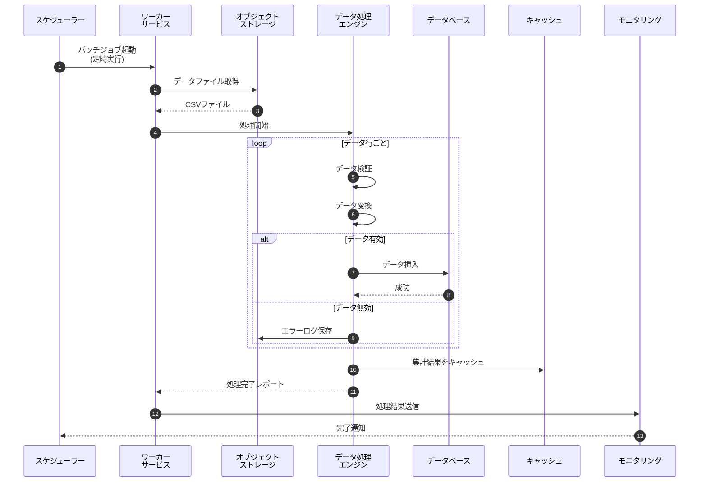
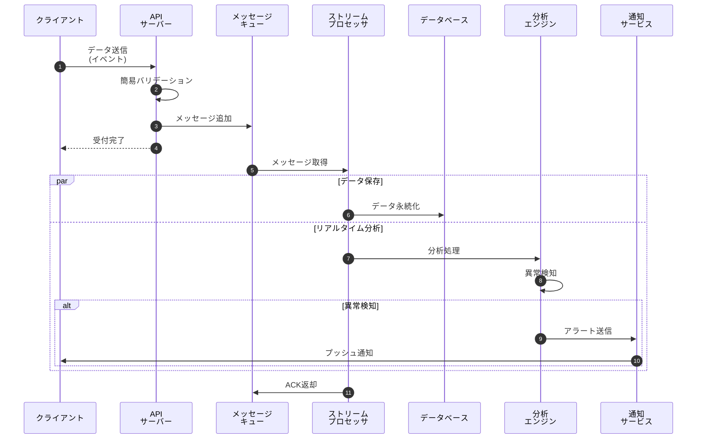
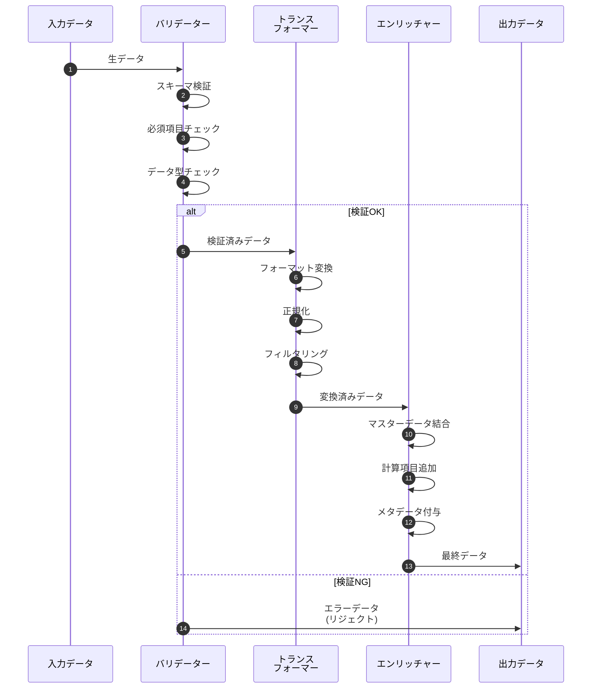
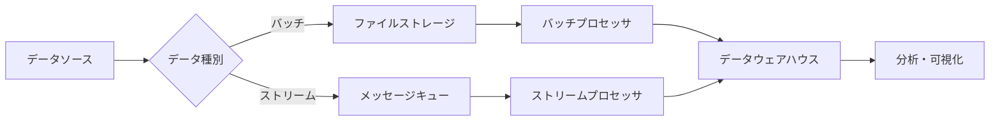

# データ処理フロー

## 概要

大量データの取り込みから処理、保存までの一連のフローを示します。バッチ処理とストリーム処理の両方に対応しています。

## バッチデータ処理フロー

## リアルタイムストリーム処理フロー

## データ変換処理の詳細

## 処理パフォーマンス

### バッチ処理

| 項目 | 値 |
|---|---|
| 処理間隔 | 1時間ごと |
| 1回あたりのデータ量 | 最大100万レコード |
| 平均処理時間 | 15分 |
| 並列度 | 8ワーカー |

### ストリーム処理

| 項目 | 値 |
|---|---|
| スループット | 10,000メッセージ/秒 |
| レイテンシ | < 100ms (p99) |
| リトライ回数 | 最大3回 |
| デッドレターキュー | 有効 |

## エラーハンドリング

!!! danger "重要"
    - データ処理エラーは必ずログに記録
    - リトライ可能なエラーは自動リトライ
    - 致命的エラーはアラート送信

!!! tip "ベストプラクティス"
    - バッチサイズを適切に設定してメモリ使用量を最適化
    - 冪等性を保証して重複実行に対応
    - モニタリングで処理状況を可視化

## データフロー概念図

