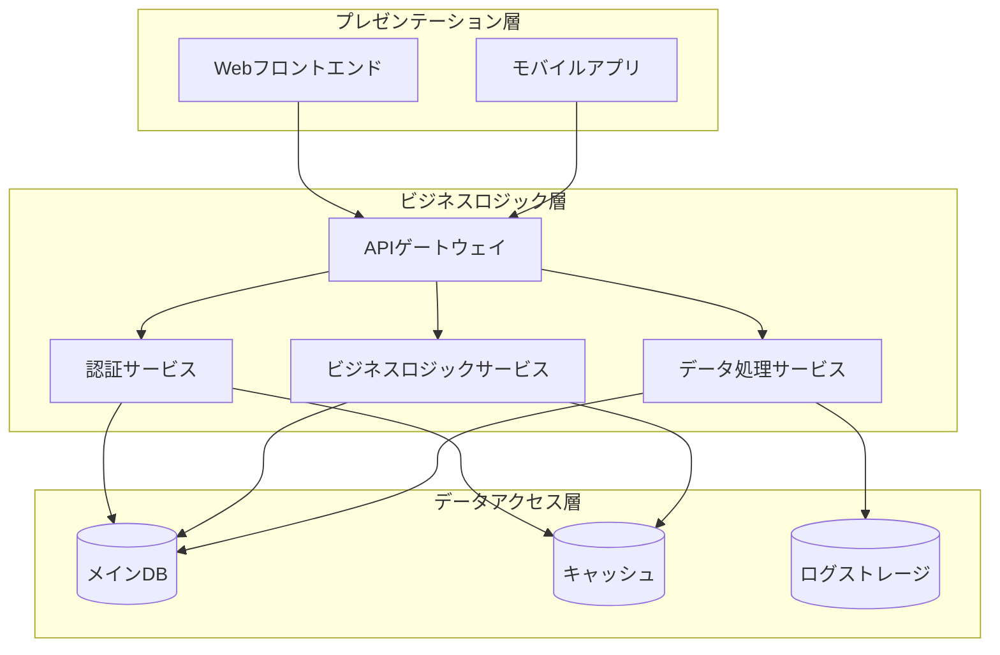

# システムアーキテクチャ

## 概要

本システムは3層アーキテクチャを採用しており、プレゼンテーション層、ビジネスロジック層、データアクセス層で構成されています。

## アーキテクチャ図

## 主要コンポーネント

### APIゲートウェイ
- リクエストのルーティング
- 認証・認可の統一的な処理
- レート制限

### 認証サービス
- ユーザー認証
- トークン管理
- セッション管理

### ビジネスロジックサービス
- コアビジネスロジックの実装
- トランザクション管理

### データ処理サービス
- 大量データの処理
- バッチ処理
- データ変換

## 技術スタック

| 層 | 技術 |
|---|---|
| フロントエンド | React, TypeScript |
| バックエンド | Node.js, Python |
| データベース | PostgreSQL, Redis |
| インフラ | Docker, Kubernetes |

!!! note "備考"
    各サービスはマイクロサービスアーキテクチャで独立して開発・デプロイ可能です。
