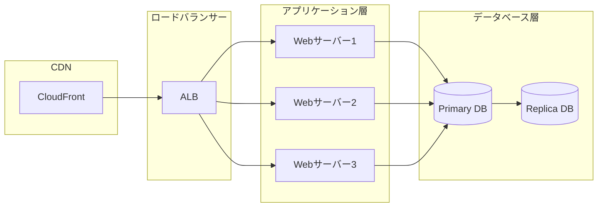

# システム構成

## 本番環境構成

## 環境一覧

### 開発環境
- **目的**: 開発者のローカル開発
- **インフラ**: Docker Compose
- **データベース**: PostgreSQL (ローカル)

### ステージング環境
- **目的**: 本番リリース前の検証
- **インフラ**: AWS ECS
- **データベース**: RDS (t3.medium)

### 本番環境
- **目的**: 本番サービス提供
- **インフラ**: AWS ECS
- **データベース**: RDS (r5.xlarge) + Read Replica

## リソース構成

| リソース | 開発 | ステージング | 本番 |
|---|---|---|---|
| Webサーバー | 1 | 2 | 3+ (Auto Scaling) |
| DBインスタンス | 1 | 1 | 1 + Replica |
| キャッシュ | Local | ElastiCache t3.micro | ElastiCache r5.large |

!!! warning "注意"
    本番環境へのアクセスは厳格に管理されています。必ずVPN経由でアクセスしてください。
