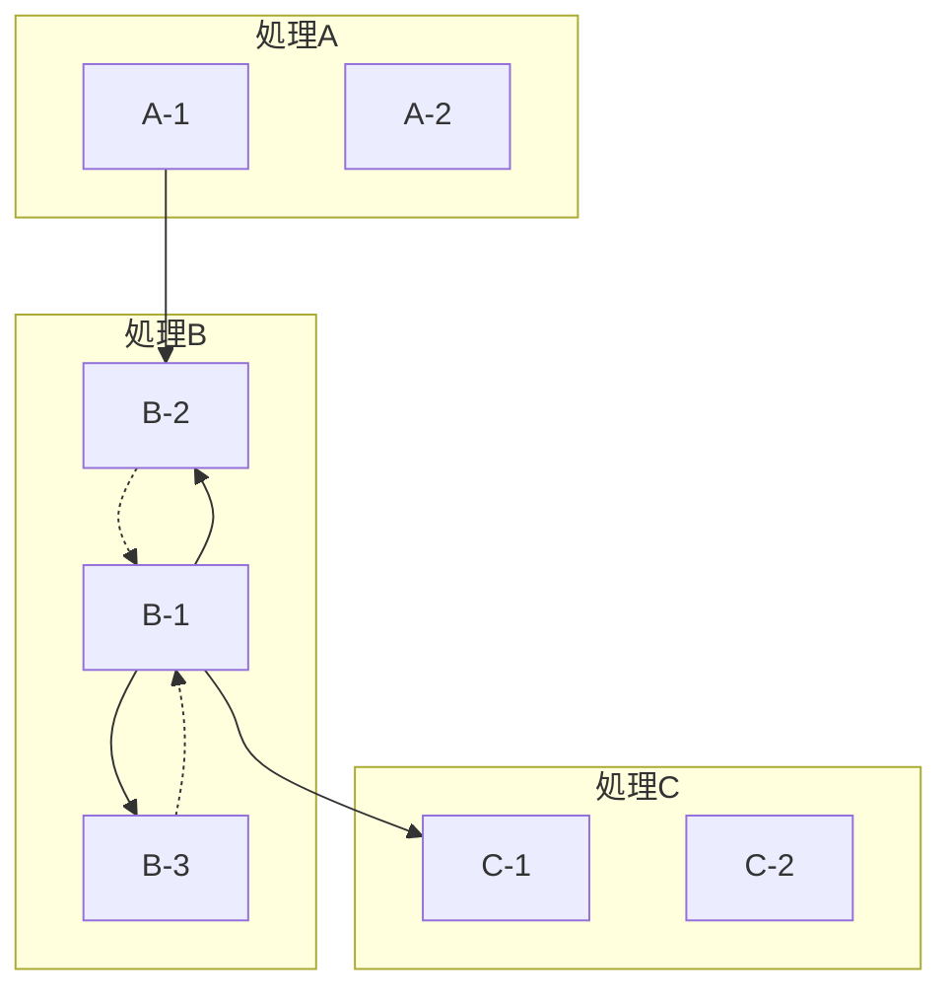

# お試しで図を書くためのスペース

## 概要

ここはMermaidのさまざまな図をお試しで書くためのスペースです

## ブロック図

```mermaid
flowchart TD
    subgraph S1[処理A]
        direction LR
        A1[A-1]
        A2[A-2]
    end
    
    subgraph S2[処理B]
        direction LR
        B1[B-1]
        B2[B-2]
        B3[B-3]
        B1 --> B2
        B2 -.-> B1
        B1 --> B3
        B3 -.-> B1
    end
    
    subgraph S3[処理C]
        direction LR
        C1[C-1]
        C2[C-2]
    end
    A1 --> B2
    B1 --> C1
```
