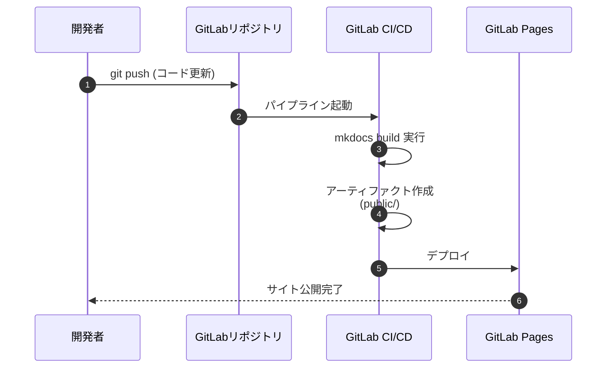
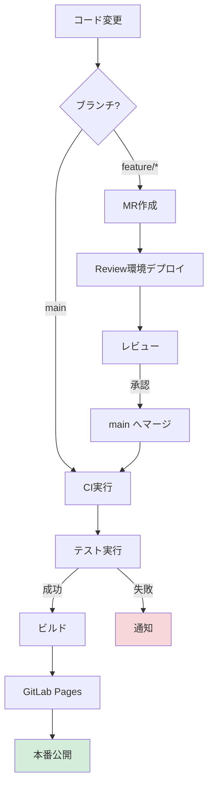

# GitLabでのMkDocsデプロイ手順

このドキュメントでは、GitLabを使用してMkDocsサイトをデプロイする方法を詳しく解説します。

## 目次

1. [GitLab Pagesへのデプロイ](#gitlab-pagesへのデプロイ)
2. [GitLab CI/CDパイプライン設定](#gitlab-cicdパイプライン設定)
3. [カスタムドメインの設定](#カスタムドメインの設定)
4. [環境別デプロイ](#環境別デプロイ)
5. [トラブルシューティング](#トラブルシューティング)

---

## GitLab Pagesへのデプロイ

GitLab Pagesは、GitLabが提供する静的サイトホスティングサービスです。
MkDocsで生成したサイトを無料でホスティングできます。

### デプロイの仕組み



### 基本的な.gitlab-ci.yml

プロジェクトのルートディレクトリに `.gitlab-ci.yml` を作成します。

```yaml
image: python:3.11

pages:
  stage: deploy
  script:
    # 依存パッケージのインストール
    - pip install -r requirements.txt
    # MkDocsでビルド
    - mkdocs build --strict
    # GitLab Pagesは public/ ディレクトリを公開する
    - mv site public
  artifacts:
    paths:
      - public
  rules:
    # mainブランチへのプッシュ時のみ実行
    - if: $CI_COMMIT_BRANCH == $CI_DEFAULT_BRANCH
```

### デプロイ手順

#### 1. .gitlab-ci.yml をリポジトリに追加

```bash
# .gitlab-ci.yml を作成
cat > .gitlab-ci.yml << 'EOF'
image: python:3.11

pages:
  stage: deploy
  script:
    - pip install -r requirements.txt
    - mkdocs build --strict
    - mv site public
  artifacts:
    paths:
      - public
  rules:
    - if: $CI_COMMIT_BRANCH == $CI_DEFAULT_BRANCH
EOF

# GitLabにプッシュ
git add .gitlab-ci.yml
git commit -m "Add GitLab CI/CD configuration for Pages"
git push origin main
```

#### 2. パイプラインの実行確認

1. GitLabのプロジェクトページにアクセス
2. 左メニューから **CI/CD > Pipelines** を選択
3. パイプラインが正常に完了することを確認

#### 3. サイトのアクセス

デプロイが完了すると、以下のURLでアクセス可能になります:

- **プロジェクトページ**: `https://<username>.gitlab.io/<project-name>/`
- **グループページ**: `https://<groupname>.gitlab.io/<project-name>/`

確認方法:
1. GitLabプロジェクトページ
2. 左メニュー **Settings > Pages**
3. "Access pages" セクションにURLが表示される

---

## GitLab CI/CDパイプライン設定

### より高度な.gitlab-ci.yml

複数の環境やテストを含む実践的な設定例です。

```yaml
# ベースイメージ
image: python:3.11-slim

# ステージ定義
stages:
  - test
  - build
  - deploy

# 共通の事前処理
before_script:
  - pip install -r requirements.txt

# キャッシュ設定（ビルド高速化）
cache:
  paths:
    - .cache/pip

# リンクチェック
link-check:
  stage: test
  script:
    - mkdocs build --strict
    - echo "リンクチェック完了"
  rules:
    - if: $CI_PIPELINE_SOURCE == "merge_request_event"
    - if: $CI_COMMIT_BRANCH == $CI_DEFAULT_BRANCH

# Markdown構文チェック
markdown-lint:
  stage: test
  image: node:18
  before_script:
    - npm install -g markdownlint-cli
  script:
    - markdownlint 'docs/**/*.md' --config .markdownlint.json
  allow_failure: true
  rules:
    - if: $CI_PIPELINE_SOURCE == "merge_request_event"
    - if: $CI_COMMIT_BRANCH == $CI_DEFAULT_BRANCH

# ビルドテスト
build-test:
  stage: build
  script:
    - mkdocs build --strict --verbose
  artifacts:
    paths:
      - site/
    expire_in: 1 hour
  rules:
    - if: $CI_PIPELINE_SOURCE == "merge_request_event"

# 本番デプロイ (GitLab Pages)
pages:
  stage: deploy
  script:
    - mkdocs build --strict
    - mv site public
  artifacts:
    paths:
      - public
    expire_in: 30 days
  rules:
    - if: $CI_COMMIT_BRANCH == $CI_DEFAULT_BRANCH
  environment:
    name: production
    url: https://$CI_PROJECT_NAMESPACE.gitlab.io/$CI_PROJECT_NAME

# レビュー環境 (マージリクエスト用)
review:
  stage: deploy
  script:
    - mkdocs build --strict
    - mv site public
  artifacts:
    paths:
      - public
  rules:
    - if: $CI_PIPELINE_SOURCE == "merge_request_event"
  environment:
    name: review/$CI_COMMIT_REF_NAME
    url: https://$CI_PROJECT_NAMESPACE.gitlab.io/-/$CI_PROJECT_NAME/-/jobs/$CI_JOB_ID/artifacts/public/index.html
    on_stop: stop-review
    auto_stop_in: 1 week

# レビュー環境の削除
stop-review:
  stage: deploy
  script:
    - echo "Stopping review environment"
  rules:
    - if: $CI_PIPELINE_SOURCE == "merge_request_event"
      when: manual
  environment:
    name: review/$CI_COMMIT_REF_NAME
    action: stop
```

### Markdownlint設定ファイル

`.markdownlint.json` を作成（Markdown品質チェック用）:

```json
{
  "default": true,
  "MD013": false,
  "MD033": false,
  "MD041": false
}
```

---

## カスタムドメインの設定

### 独自ドメインでの公開

#### 1. DNSレコードの設定

DNSプロバイダーで以下のレコードを追加:

**Aレコード:**
```
Type: A
Name: @ (または www)
Value: 35.185.44.232
```

**CNAMEレコード:**
```
Type: CNAME
Name: www
Value: <username>.gitlab.io
```

#### 2. GitLabでのドメイン設定

1. プロジェクトページ > **Settings > Pages**
2. "New Domain" をクリック
3. ドメイン名を入力（例: `docs.example.com`）
4. "Create New Domain" をクリック

#### 3. SSL/TLS証明書の設定

GitLabは Let's Encrypt を使用して自動的にSSL証明書を発行します。

```yaml
# .gitlab-ci.yml に追加
pages:
  stage: deploy
  script:
    - mkdocs build --strict
    - mv site public
  artifacts:
    paths:
      - public
  rules:
    - if: $CI_COMMIT_BRANCH == $CI_DEFAULT_BRANCH
  environment:
    name: production
    url: https://docs.example.com  # カスタムドメイン
```

### mkdocs.ymlでのURL設定

```yaml
site_name: システム設計書
site_url: https://docs.example.com  # カスタムドメインを指定

# 絶対URLを使用
use_directory_urls: true
```

---

## 環境別デプロイ

### 複数環境の構成


### 環境別設定ファイル

#### ステージング環境用 .gitlab-ci.yml

```yaml
# ステージング環境へのデプロイ
deploy-staging:
  stage: deploy
  script:
    - mkdocs build --strict
    - mv site public
  artifacts:
    paths:
      - public
  rules:
    - if: $CI_COMMIT_BRANCH == "develop"
  environment:
    name: staging
    url: https://staging-$CI_PROJECT_NAME.gitlab.io
  only:
    - develop

# 本番環境へのデプロイ（手動承認）
deploy-production:
  stage: deploy
  script:
    - mkdocs build --strict
    - mv site public
  artifacts:
    paths:
      - public
  rules:
    - if: $CI_COMMIT_BRANCH == "main"
      when: manual  # 手動実行が必要
  environment:
    name: production
    url: https://$CI_PROJECT_NAMESPACE.gitlab.io/$CI_PROJECT_NAME
```

### 環境変数の使用

GitLab CI/CD環境変数を使用した設定:

1. **Settings > CI/CD > Variables** で環境変数を設定

| 変数名 | 値 | 保護 | マスク |
|--------|-----|------|--------|
| `PROD_URL` | `https://docs.example.com` | ✓ | - |
| `STAGING_URL` | `https://staging.example.com` | - | - |

2. **.gitlab-ci.yml で使用:**

```yaml
pages:
  stage: deploy
  script:
    - echo "site_url:${PROD_URL}" >> mkdocs.yml
    - mkdocs build --strict
    - mv site public
  artifacts:
    paths:
      - public
  rules:
    - if: $CI_COMMIT_BRANCH == $CI_DEFAULT_BRANCH
```

---

## スケジュール実行

### 定期的なビルドの設定

1. **CI/CD > Schedules** にアクセス
2. "New schedule" をクリック
3. 以下を設定:
   - **Description**: 定期ビルド（毎日深夜）
   - **Interval Pattern**: `0 2 * * *` （毎日2時）
   - **Target Branch**: `main`

```yaml
# .gitlab-ci.yml
scheduled-build:
  stage: deploy
  script:
    - mkdocs build --strict
    - mv site public
  artifacts:
    paths:
      - public
  only:
    - schedules
  environment:
    name: production
```

---

## デプロイ通知の設定

### Slackへの通知

```yaml
notify-slack:
  stage: deploy
  script:
    - |
      curl -X POST -H 'Content-type: application/json' \
      --data "{\"text\":\"✅ MkDocsサイトがデプロイされました\n環境: $CI_ENVIRONMENT_NAME\nURL: $CI_ENVIRONMENT_URL\"}" \
      $SLACK_WEBHOOK_URL
  rules:
    - if: $CI_COMMIT_BRANCH == $CI_DEFAULT_BRANCH
      when: on_success
```

環境変数 `SLACK_WEBHOOK_URL` を設定:
1. **Settings > CI/CD > Variables**
2. Key: `SLACK_WEBHOOK_URL`
3. Value: Slack Webhook URL
4. Masked: チェック

---

## パフォーマンス最適化

### ビルド時間の短縮

```yaml
image: python:3.11-slim

# Dockerレイヤーキャッシュを活用
cache:
  key: ${CI_COMMIT_REF_SLUG}
  paths:
    - .cache/pip
    - venv/

before_script:
  # 仮想環境を使用してキャッシュを効率化
  - python -m venv venv
  - source venv/bin/activate
  - pip install --cache-dir .cache/pip -r requirements.txt

pages:
  stage: deploy
  script:
    - source venv/bin/activate
    - mkdocs build --strict
    - mv site public
  artifacts:
    paths:
      - public
```

### 並列実行

```yaml
stages:
  - test
  - build
  - deploy

# テストを並列実行
test:lint:
  stage: test
  script:
    - markdownlint 'docs/**/*.md'
  parallel:
    matrix:
      - DOCS_DIR: ['docs/diagrams', 'docs/guides', 'docs/overview']

test:build:
  stage: test
  script:
    - mkdocs build --strict
```

---

## トラブルシューティング

### よくある問題と解決方法

#### 1. ビルドエラー: "command not found: mkdocs"

**原因:** requirements.txtが読み込まれていない

**解決策:**
```yaml
before_script:
  - pip install -r requirements.txt
```

#### 2. 404エラー: ページが見つからない

**原因:** `public/` ディレクトリが正しく生成されていない

**確認:**
```yaml
pages:
  script:
    - mkdocs build --strict --verbose  # 詳細ログ出力
    - ls -la site/  # ファイル確認
    - mv site public
```

#### 3. CSSが適用されていない

**原因:** `site_url` の設定が不適切

**解決策:**
```yaml
# mkdocs.yml
site_url: https://<username>.gitlab.io/<project-name>/
```

#### 4. Mermaid図が表示されない

**確認項目:**
- requirements.txtに `mkdocs-mermaid2-plugin` が含まれているか
- mkdocs.ymlにプラグイン設定があるか

```yaml
# mkdocs.yml
plugins:
  - mermaid2
```

#### 5. パイプラインが実行されない

**確認項目:**
1. `.gitlab-ci.yml` がリポジトリのルートにあるか
2. YAMLの構文が正しいか（インデント確認）
3. CI/CDが有効になっているか（Settings > General > Visibility）

**YAMLバリデーション:**
```bash
# ローカルで構文チェック
python -m yaml .gitlab-ci.yml
```

または GitLab の CI Lint を使用:
`https://gitlab.com/<username>/<project>/-/ci/lint`

---

## セキュリティベストプラクティス

### 1. 保護されたブランチ

**Settings > Repository > Protected branches** で main ブランチを保護:
- ✓ Allowed to merge: Maintainers
- ✓ Allowed to push: No one
- ✓ Require approval: 1 approval

### 2. シークレットの管理

機密情報は環境変数に格納:

```yaml
# .gitlab-ci.yml
pages:
  script:
    - echo "API_KEY=${API_KEY}" > .env
    - mkdocs build --strict
  variables:
    GIT_STRATEGY: clone
```

**重要:** `.env` ファイルは `.gitignore` に追加

### 3. アーティファクトの有効期限

```yaml
pages:
  artifacts:
    paths:
      - public
    expire_in: 30 days  # 30日後に自動削除
```

---

## モニタリングとメトリクス

### デプロイ状況の確認

```yaml
pages:
  stage: deploy
  script:
    - mkdocs build --strict
    - mv site public
    # デプロイ時刻を記録
    - echo "Deployed at $(date)" > public/deploy-info.txt
  artifacts:
    paths:
      - public
    reports:
      dotenv: deploy.env
```

### アクセス解析の追加

```yaml
# mkdocs.yml
extra:
  analytics:
    provider: google
    property: G-XXXXXXXXXX
```

---

## まとめ

### デプロイフロー全体像



### チェックリスト

- [ ] `.gitlab-ci.yml` をリポジトリに追加
- [ ] `requirements.txt` が正しく設定されている
- [ ] パイプラインが正常に実行される
- [ ] GitLab PagesのURLでサイトにアクセス可能
- [ ] カスタムドメインを設定（必要な場合）
- [ ] SSL証明書が有効になっている
- [ ] レビュー環境が正しく動作する
- [ ] 環境変数が適切に設定されている
- [ ] デプロイ通知が機能している

---

## 参考リンク

- [GitLab Pages公式ドキュメント](https://docs.gitlab.com/ee/user/project/pages/)
- [GitLab CI/CD YAML設定リファレンス](https://docs.gitlab.com/ee/ci/yaml/)
- [MkDocs公式ドキュメント](https://www.mkdocs.org/)
- [Material for MkDocs](https://squidfunk.github.io/mkdocs-material/)

---

## サンプルプロジェクト

完全な設定例は以下のリポジトリを参照:

```
https://gitlab.com/example/mkdocs-sample
```

このドキュメントを参考に、GitLab CI/CDを使った自動デプロイを実現できます。
