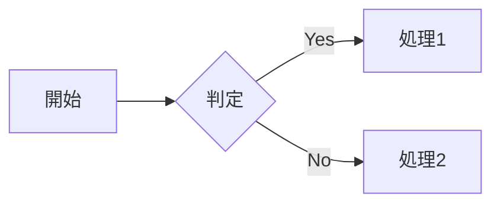
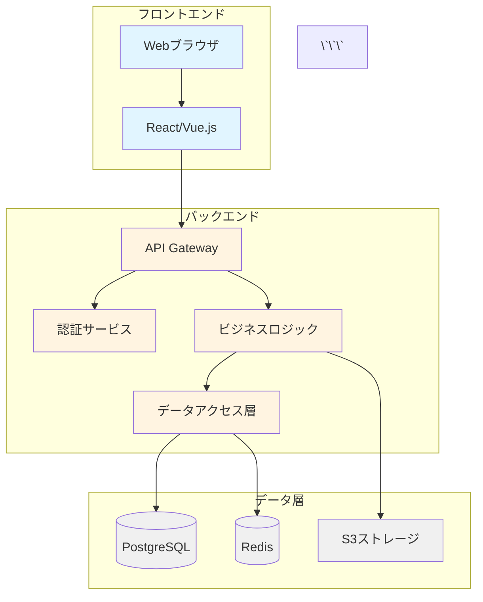
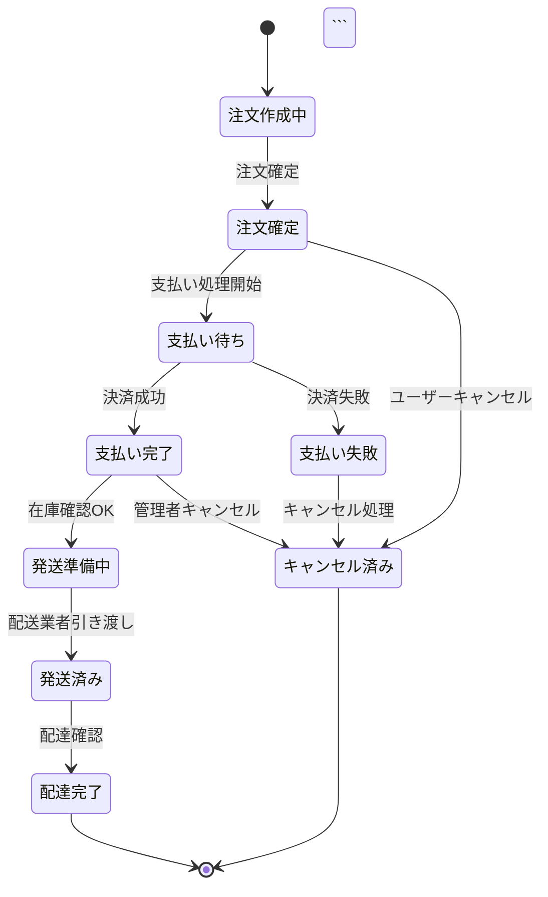

# mkdocs.yml 詳細解析・解説

このドキュメントでは、`mkdocs.yml`ファイルの各設定項目について詳細に解析・解説します。

## 目次

1. [基本サイト情報](#基本サイト情報)
2. [テーマ設定](#テーマ設定)
3. [カラーパレット](#カラーパレット)
4. [ナビゲーション機能](#ナビゲーション機能)
5. [Markdown拡張機能](#markdown拡張機能)
6. [プラグイン](#プラグイン)
7. [外部JavaScript](#外部javascript)
8. [ナビゲーション構造](#ナビゲーション構造)

---

## 基本サイト情報

```yaml
site_name: システム設計書
site_description: サンプルシステムの設計ドキュメント
site_author: Development Team
```

### 解説

- **site_name**: サイトのタイトル。ブラウザのタブやページヘッダーに表示される
- **site_description**: サイトの説明。SEO対策に使用され、検索エンジンの結果に表示される
- **site_author**: 作成者情報。メタデータとして埋め込まれる

### カスタマイズのヒント

- `site_name`は簡潔で分かりやすい名前にする
- `site_description`は150文字以内で、サイトの内容を正確に表現する
- `site_author`は個人名またはチーム名を記載する

---

## テーマ設定

```yaml
theme:
  name: material
  language: ja
```

### 解説

- **name: material**: MkDocsの人気テーマ「Material for MkDocs」を使用
  - モダンでレスポンシブなデザイン
  - 豊富な機能とカスタマイズ性
  - Googleのマテリアルデザインガイドラインに準拠

- **language: ja**: UIの言語を日本語に設定
  - 検索ボックスのプレースホルダー
  - ナビゲーション要素
  - 自動生成されるテキストが日本語化される

### カスタマイズのヒント

- Materialテーマは`pip install mkdocs-material`でインストール必要
- 他の言語コード: `en`（英語）、`zh`（中国語）、`ko`（韓国語）など

---

## カラーパレット

```yaml
palette:
  # Light mode
  - media: "(prefers-color-scheme: light)"
    scheme: default
    primary: indigo
    accent: indigo
    toggle:
      icon: material/brightness-7
      name: ダークモードに切り替え
  # Dark mode
  - media: "(prefers-color-scheme: dark)"
    scheme: slate
    primary: indigo
    accent: indigo
    toggle:
      icon: material/brightness-4
      name: ライトモードに切り替え
```

### 解説

#### ライトモード設定

- **media**: OSのカラースキーム設定に連動（ライトモード優先時）
- **scheme: default**: ライトカラースキームを使用
- **primary: indigo**: プライマリカラー（ヘッダー、リンクなど）をインディゴに設定
- **accent: indigo**: アクセントカラー（ホバー、アクティブ状態）をインディゴに設定
- **toggle**: モード切り替えボタンの設定
  - `icon: material/brightness-7`: 太陽アイコン
  - `name`: ボタンのツールチップテキスト

#### ダークモード設定

- **scheme: slate**: ダークカラースキームを使用
- 同様のカラー設定でダークモード用にカスタマイズ
- `icon: material/brightness-4`: 月アイコン

### 利用可能なカラーオプション

**Primary/Accentカラー:**
- `red`, `pink`, `purple`, `deep-purple`
- `indigo`, `blue`, `light-blue`, `cyan`
- `teal`, `green`, `light-green`, `lime`
- `yellow`, `amber`, `orange`, `deep-orange`
- `brown`, `grey`, `blue-grey`, `black`, `white`

### カスタマイズのヒント

- ブランドカラーに合わせてprimaryとaccentを変更
- 複数のカラースキームを定義して、ユーザーに選択肢を提供可能
- `media`を削除すると、OSの設定に関係なく常に表示される

---

## ナビゲーション機能

```yaml
features:
  - navigation.tabs
  - navigation.sections
  - navigation.expand
  - navigation.top
  - search.suggest
  - search.highlight
  - content.code.copy
  - content.code.annotate
```

### 解説

#### ナビゲーション関連

- **navigation.tabs**: トップレベルのセクションをタブとして表示
  - 大規模なドキュメントに最適
  - ヘッダー部分に水平タブが表示される

- **navigation.sections**: サイドバーでセクションをグループ化
  - 階層構造を視覚的に分かりやすく表示

- **navigation.expand**: サイドバーのセクションをデフォルトで展開
  - すべてのページが最初から見える状態

- **navigation.top**: 「トップへ戻る」ボタンを表示
  - 長いページをスクロールした際に便利

#### 検索機能

- **search.suggest**: 検索時に候補を自動表示
  - インクリメンタル検索で使いやすさ向上

- **search.highlight**: 検索結果のキーワードをハイライト
  - 検索語がページ内で強調表示される

#### コンテンツ機能

- **content.code.copy**: コードブロックにコピーボタンを追加
  - ワンクリックでコードをクリップボードにコピー

- **content.code.annotate**: コードにアノテーション（注釈）を追加可能
  - コード内に番号付きコメントを配置できる

### その他の便利な機能（未使用）

```yaml
# 追加可能な機能例
- navigation.instant      # ページ遷移を高速化（SPA風）
- navigation.tracking     # URLにセクションを追跡
- navigation.indexes      # インデックスページを使用
- toc.integrate           # 目次をサイドバーに統合
- header.autohide         # スクロール時にヘッダーを自動非表示
```

---

## Markdown拡張機能

```yaml
markdown_extensions:
  - pymdownx.superfences:
      custom_fences:
        - name: mermaid
          class: mermaid
          format: !!python/name:pymdownx.superfences.fence_code_format
  - pymdownx.tabbed:
      alternate_style: true
  - admonition
  - pymdownx.details
  - pymdownx.highlight:
      anchor_linenums: true
  - pymdownx.inlinehilite
  - pymdownx.snippets
  - attr_list
  - md_in_html
  - tables
  - toc:
      permalink: true
```

### 解説

#### pymdownx.superfences

高度なコードフェンス機能を提供。

```yaml
custom_fences:
  - name: mermaid
    class: mermaid
    format: !!python/name:pymdownx.superfences.fence_code_format
```

- **mermaidダイアグラム対応**: ` ```mermaid `でダイアグラムを記述可能
- フローチャート、シーケンス図、ガントチャートなどを生成

**使用例:**
````markdown

````

#### pymdownx.tabbed

タブ形式のコンテンツを作成。

- **alternate_style: true**: 新しいスタイルのタブを使用

**使用例:**
```markdown
=== "Python"
    ```python
    print("Hello")
    ```

=== "JavaScript"
    ```javascript
    console.log("Hello");
    ```
```

#### admonition

注意書きやヒントボックスを作成。

**使用例:**
```markdown
!!! note "ノート"
    これは重要な情報です。

!!! warning "警告"
    注意が必要です。

!!! tip "ヒント"
    便利な情報です。
```

**利用可能なタイプ:**
- `note`, `abstract`, `info`, `tip`, `success`
- `question`, `warning`, `failure`, `danger`, `bug`
- `example`, `quote`

#### pymdownx.details

折りたたみ可能な詳細セクション。

**使用例:**
```markdown
??? note "クリックして展開"
    折りたたまれた内容がここに表示されます。

???+ warning "デフォルトで展開"
    `???+`を使うと最初から展開状態。
```

#### pymdownx.highlight

コードのシンタックスハイライト。

- **anchor_linenums: true**: 行番号にアンカーリンクを追加
  - 特定の行にリンク可能

**使用例:**
````markdown
```python linenums="1"
def hello():
    print("Hello, World!")
```
````

#### pymdownx.inlinehilite

インラインコードのハイライト。

**使用例:**
```markdown
この`#!python print()`はPythonコードです。
```

#### pymdownx.snippets

外部ファイルの内容を埋め込み。

**使用例:**
```markdown
--8<-- "path/to/file.md"
```

#### attr_list

HTML属性をMarkdown要素に追加。

**使用例:**
```markdown
{ width="300" }

[リンク](https://example.com){ target="_blank" }
```

#### md_in_html

HTML内でMarkdownを使用可能。

**使用例:**
```html
<div markdown>
## 見出し
- リスト1
- リスト2
</div>
```

#### tables

テーブル記法のサポート（標準Markdown拡張）。

**使用例:**
```markdown
| 列1 | 列2 | 列3 |
|-----|-----|-----|
| A   | B   | C   |
| D   | E   | F   |
```

#### toc

目次（Table of Contents）の生成。

- **permalink: true**: 各見出しにパーマリンクアイコンを追加
  - 見出しに直接リンク可能

---

## プラグイン

```yaml
plugins:
  - search:
      lang: ja
  - mermaid2
```

### 解説

#### search

サイト内検索機能を提供。

- **lang: ja**: 日本語検索に最適化
  - 日本語のトークナイズに対応
  - ひらがな・カタカナ・漢字の検索が適切に動作

#### mermaid2

Mermaid図の描画をサポート。

- `pymdownx.superfences`のmermaid設定と連携
- JavaScriptライブラリを自動的に読み込み

**注意点:**
- `pip install mkdocs-mermaid2-plugin`が必要
- 最新版では`mermaid2`の代わりに別の実装が推奨される場合がある

### その他の便利なプラグイン

```yaml
# 追加可能なプラグイン例
- minify:             # HTML/CSS/JSの最小化
    minify_html: true
- git-revision-date-localized:  # 最終更新日を表示: pip install mkdocs-git-revision-date-localized-plugin
    type: datetime
    fallback_to_build_date: true
- awesome-pages       # ページ順序の柔軟な管理
- pdf-export          # PDFエクスポート機能
```

#### git-revision-date-localized

Git リポジトリの履歴から各ページの最終更新日時を自動取得して表示

**特徴**

- Git から自動抽出なので、手動で日付を管理不要
- ページ下部に「Last updated: 2025-12-21」のような表示
- 言語ローカライズに対応（日本語なら「最終更新: 2025年12月21日」）

**使いどころ**

- チームで共同編集するドキュメント
- ドキュメントの鮮度が重要な場合
- 読者が「このドキュメントはいつ更新されたか」を知りたい場合


---

## 外部JavaScript

```yaml
extra_javascript:
  - https://unpkg.com/mermaid@10/dist/mermaid.min.js
```

### 解説

- **Mermaid.js**: ダイアグラム描画ライブラリ
  - CDN（unpkg）からバージョン10を読み込み
  - フローチャート、シーケンス図などをレンダリング

### カスタマイズのヒント

- バージョンを固定する場合: `mermaid@10.6.1/dist/mermaid.min.js`
- 他の外部ライブラリも同様に追加可能
  - MathJax（数式表示）
  - Chart.js（グラフ表示）
  - カスタムスクリプト

**追加例:**
```yaml
extra_javascript:
  - https://unpkg.com/mermaid@10/dist/mermaid.min.js
  - javascripts/custom.js
  - https://cdn.jsdelivr.net/npm/mathjax@3/es5/tex-mml-chtml.js
```

---

## ナビゲーション構造

```yaml
nav:
  - ホーム: index.md
  - システム概要:
    - アーキテクチャ: overview/architecture.md
    - システム構成: overview/system-config.md
  - シーケンス図:
    - ユーザー認証フロー: diagrams/auth-sequence.md
    - データ処理フロー: diagrams/data-processing.md
    - API連携フロー: diagrams/api-integration.md
  - ガイド:
    - セットアップ手順: guides/setup.md
    - デプロイ手順: guides/deployment.md
```

### 解説

#### 構造

3階層のナビゲーション構造:
1. トップレベル（タブ表示）: ホーム、システム概要、シーケンス図、ガイド
2. セクション: 各トップレベル配下のグループ
3. ページ: 実際のMarkdownファイル

#### パス指定

- **相対パス**: `docs/`ディレクトリからの相対パス
  - `index.md` → `docs/index.md`
  - `overview/architecture.md` → `docs/overview/architecture.md`

#### ディレクトリ構造（想定）

```
project/
├── mkdocs.yml
└── docs/
    ├── index.md
    ├── overview/
    │   ├── architecture.md
    │   └── system-config.md
    ├── diagrams/
    │   ├── auth-sequence.md
    │   ├── data-processing.md
    │   └── api-integration.md
    └── guides/
        ├── setup.md
        └── deployment.md
```

### カスタマイズのヒント

#### セクションの追加

```yaml
nav:
  - ホーム: index.md
  - 新しいセクション:
    - ページ1: new-section/page1.md
    - ページ2: new-section/page2.md
```

#### 外部リンクの追加

```yaml
nav:
  - ホーム: index.md
  - 外部リンク: https://example.com
```

#### 自動ナビゲーション

`nav`を省略すると、ディレクトリ構造から自動生成される:

```yaml
# navを削除または省略
# ファイル名とディレクトリ構造から自動的に構築
```

---

## 実践的なカスタマイズ例

### 1. ブランドカラーの変更

```yaml
theme:
  palette:
    - scheme: default
      primary: blue      # 青系に変更
      accent: amber      # アクセントを琥珀色に
```

### 2. 追加のMarkdown機能

```yaml
markdown_extensions:
  - pymdownx.emoji:
      emoji_index: !!python/name:material.extensions.emoji.twemoji
      emoji_generator: !!python/name:material.extensions.emoji.to_svg
  - pymdownx.arithmatex:
      generic: true
  - footnotes
  - def_list
```

### 3. ソーシャルリンクの追加

```yaml
extra:
  social:
    - icon: fontawesome/brands/github
      link: https://github.com/yourorg
    - icon: fontawesome/brands/twitter
      link: https://twitter.com/yourorg
```

### 4. カスタムCSSの追加

```yaml
extra_css:
  - stylesheets/extra.css
```

### 5. ロゴとファビコンの設定

```yaml
theme:
  logo: assets/logo.png
  favicon: assets/favicon.ico
```

---

## トラブルシューティング

### よくある問題と解決方法

#### 1. Mermaid図が表示されない

**原因:**
- `mermaid2`プラグインが未インストール
- JavaScriptの読み込み順序の問題

**解決方法:**
```bash
pip install mkdocs-mermaid2-plugin
```

#### 2. 日本語検索が正しく動作しない

**原因:**
- `lang: ja`の設定漏れ

**解決方法:**
```yaml
plugins:
  - search:
      lang: ja
      separator: '[\s\-\.]+'
```

#### 3. カスタムカラーが反映されない

**原因:**
- YAMLのインデントが正しくない
- カラー名のスペルミス

**解決方法:**
- インデントを確認（2スペース推奨）
- 有効なカラー名を使用

#### 4. ページが見つからない（404）

**原因:**
- `nav`で指定したファイルパスが間違っている
- ファイルが`docs/`ディレクトリ内に存在しない

**解決方法:**
- ファイルパスを確認
- `docs/`ディレクトリ構造を確認

---

## パフォーマンス最適化

### 1. ビルド時間の短縮

```yaml
plugins:
  - search
  - minify:
      minify_html: true
      minify_js: true
      minify_css: true
```

### 2. キャッシュの活用

```yaml
plugins:
  - search
  - optimize  # 画像最適化プラグイン
```

### 3. 遅延読み込み

```yaml
theme:
  features:
    - navigation.instant  # SPAモード
    - navigation.tracking # URL追跡
```

---

## まとめ

この`mkdocs.yml`は、以下の特徴を持つ日本語ドキュメントサイトの設定ファイルです:

1. **Material for MkDocs**テーマを採用したモダンなUI
2. **ライト/ダークモード**の切り替え対応
3. **Mermaid図**によるダイアグラム描画
4. **豊富なMarkdown拡張**で表現力の高いドキュメント作成
5. **日本語最適化**された検索機能
6. **階層的なナビゲーション**で大規模ドキュメントに対応

### 推奨される次のステップ

1. 実際のMarkdownファイルを`docs/`ディレクトリに作成
2. `mkdocs serve`でローカルプレビューを確認
3. 必要に応じてカラーやレイアウトをカスタマイズ
4. GitHub PagesやNetlifyでデプロイ

### 参考リンク

- [MkDocs公式ドキュメント](https://www.mkdocs.org/)
- [Material for MkDocs](https://squidfunk.github.io/mkdocs-material/)
- [PyMdown Extensions](https://facelessuser.github.io/pymdown-extensions/)
- [Mermaid.js](https://mermaid.js.org/)

---

## 高度な設定とベストプラクティス

### Mermaid図の実践的な使用例

システム設計書で頻繁に使用されるMermaid図の詳細な例を紹介します。

#### 1. システムアーキテクチャ図

```markdown
# アーキテクチャ

## システム構成図



#### 2. シーケンス図（ユーザー認証フロー）

```markdown
# ユーザー認証フロー

```mermaid
sequenceDiagram
    participant U as ユーザー
    participant C as クライアント
    participant API as API Gateway
    participant Auth as 認証サービス
    participant DB as データベース

    U->>C: ログイン情報入力
    C->>API: POST /api/auth/login
    activate API
    API->>Auth: 認証リクエスト
    activate Auth
    Auth->>DB: ユーザー情報取得
    activate DB
    DB-->>Auth: ユーザーデータ
    deactivate DB

    Auth->>Auth: パスワード検証

    alt 認証成功
        Auth->>Auth: JWTトークン生成
        Auth-->>API: トークン + ユーザー情報
        deactivate Auth
        API-->>C: 200 OK + トークン
        deactivate API
        C->>C: トークン保存
        C-->>U: ログイン成功
    else 認証失敗
        Auth-->>API: 401 Unauthorized
        deactivate Auth
        API-->>C: 401 エラー
        deactivate API
        C-->>U: ログイン失敗
    end
\`\`\`
```

#### 3. ER図（データモデル）

```markdown
# データモデル

```mermaid
erDiagram
    USER ||--o{ ORDER : places
    USER {
        int user_id PK
        string email UK
        string password_hash
        string name
        datetime created_at
        datetime updated_at
    }

    ORDER ||--|{ ORDER_ITEM : contains
    ORDER {
        int order_id PK
        int user_id FK
        decimal total_amount
        string status
        datetime ordered_at
    }

    ORDER_ITEM }o--|| PRODUCT : references
    ORDER_ITEM {
        int order_item_id PK
        int order_id FK
        int product_id FK
        int quantity
        decimal price
    }

    PRODUCT {
        int product_id PK
        string name
        text description
        decimal price
        int stock
    }
\`\`\`
```

#### 4. ガントチャート（プロジェクト計画）

```markdown
# プロジェクトスケジュール

```mermaid
gantt
    title 開発スケジュール
    dateFormat YYYY-MM-DD
    section 設計フェーズ
    要件定義           :done,    des1, 2024-01-01, 2024-01-14
    基本設計           :done,    des2, 2024-01-15, 2024-01-31
    詳細設計           :active,  des3, 2024-02-01, 2024-02-21

    section 開発フェーズ
    バックエンド開発   :         dev1, 2024-02-22, 45d
    フロントエンド開発 :         dev2, 2024-02-22, 45d
    API統合            :         dev3, 2024-03-25, 14d

    section テストフェーズ
    単体テスト         :         test1, 2024-04-01, 14d
    結合テスト         :         test2, 2024-04-15, 14d
    システムテスト     :         test3, 2024-04-29, 10d

    section リリース
    本番デプロイ       :crit,    rel1, 2024-05-09, 3d
\`\`\`
```

#### 5. ステートマシン図

```markdown
# 注文ステータス遷移



### ページコンテンツの実装サンプル

#### index.md - トップページ

```markdown
# システム設計書へようこそ

このドキュメントは、サンプルシステムの設計および実装に関する包括的なガイドです。

## ドキュメントの構成

このサイトは以下のセクションで構成されています:

### :material-information-outline: システム概要

システムの全体像とアーキテクチャについて説明します。

- **[アーキテクチャ](overview/architecture.md)**: システム全体の構成と技術スタック
- **[システム構成](overview/system-config.md)**: インフラストラクチャとデプロイ構成

### :material-chart-timeline-variant: シーケンス図

主要な処理フローを視覚的に表現します。

- **[ユーザー認証フロー](diagrams/auth-sequence.md)**: ログイン・ログアウトの処理
- **[データ処理フロー](diagrams/data-processing.md)**: データの入力から保存までの流れ
- **[API連携フロー](diagrams/api-integration.md)**: 外部APIとの連携処理

### :material-book-open-variant: ガイド

開発者向けの実践的なガイドです。

- **[セットアップ手順](guides/setup.md)**: 開発環境の構築方法
- **[デプロイ手順](guides/deployment.md)**: 本番環境へのデプロイ方法

## クイックスタート

!!! tip "初めての方へ"
    まずは[アーキテクチャ](overview/architecture.md)ページから読み始めることをお勧めします。

!!! example "開発を始める"
    開発環境のセットアップは[こちら](guides/setup.md)をご覧ください。

## 更新履歴

| 日付 | バージョン | 変更内容 |
|------|-----------|---------|
| 2024-01-20 | 1.2.0 | API連携フローを追加 |
| 2024-01-10 | 1.1.0 | データ処理フローを更新 |
| 2024-01-01 | 1.0.0 | 初版リリース |

## お問い合わせ

ドキュメントに関するご質問は、開発チームまでお問い合わせください。

---

:material-clock-outline: **最終更新**: 2024-01-20
:material-account-group: **作成者**: Development Team
```

#### overview/architecture.md - アーキテクチャページ

```markdown
# システムアーキテクチャ

## 概要

本システムは、モダンなマイクロサービスアーキテクチャを採用し、
スケーラビリティと保守性を重視した設計となっています。

## システム構成図

```mermaid
graph TB
    subgraph "CDN層"
        CDN[CloudFront/CDN]
    end

    subgraph "フロントエンド"
        SPA[React SPA]
    end

    subgraph "API層"
        LB[Load Balancer]
        API1[API Server 1]
        API2[API Server 2]
        API3[API Server 3]
    end

    subgraph "サービス層"
        AUTH[認証サービス]
        USER[ユーザーサービス]
        ORDER[注文サービス]
        PAYMENT[決済サービス]
    end

    subgraph "データ層"
        RDS[(RDS PostgreSQL)]
        REDIS[(Redis Cache)]
        S3[S3 Storage]
    end

    CDN --> SPA
    SPA --> LB
    LB --> API1
    LB --> API2
    LB --> API3

    API1 --> AUTH
    API1 --> USER
    API2 --> ORDER
    API3 --> PAYMENT

    AUTH --> RDS
    USER --> RDS
    ORDER --> RDS
    PAYMENT --> RDS

    AUTH --> REDIS
    USER --> REDIS

    USER --> S3
    ORDER --> S3
\`\`\`

## 技術スタック

### フロントエンド

| 技術 | バージョン | 用途 |
|------|-----------|------|
| React | 18.2.0 | UIフレームワーク |
| TypeScript | 5.0.0 | 型安全な開発 |
| Vite | 4.3.0 | ビルドツール |
| TanStack Query | 4.29.0 | サーバー状態管理 |

### バックエンド

| 技術 | バージョン | 用途 |
|------|-----------|------|
| Node.js | 20.x | ランタイム |
| Express | 4.18.0 | Webフレームワーク |
| TypeScript | 5.0.0 | 型安全な開発 |
| Prisma | 4.14.0 | ORM |

### インフラ

| 技術 | 用途 |
|------|------|
| AWS ECS | コンテナオーケストレーション |
| AWS RDS | リレーショナルデータベース |
| AWS ElastiCache | インメモリキャッシュ |
| AWS S3 | オブジェクトストレージ |
| AWS CloudFront | CDN |

## 設計原則

!!! info "マイクロサービス"
    各サービスは独立してデプロイ可能で、疎結合な設計を採用しています。

!!! success "スケーラビリティ"
    水平スケーリングが容易な構成により、トラフィック増加に対応できます。

!!! warning "セキュリティ"
    すべての通信はHTTPS/TLSで暗号化され、認証・認可を厳格に実施します。

## アーキテクチャパターン

### レイヤードアーキテクチャ

```
┌─────────────────────┐
│ Presentation Layer  │ ← コントローラー、ルーティング
├─────────────────────┤
│ Business Layer      │ ← ビジネスロジック、サービス
├─────────────────────┤
│ Data Access Layer   │ ← リポジトリ、ORM
├─────────────────────┤
│ Database Layer      │ ← PostgreSQL, Redis
└─────────────────────┘
```

### APIデザイン

RESTful APIの設計指針:

- リソース指向のURL設計
- 適切なHTTPメソッドの使用（GET, POST, PUT, DELETE）
- ステータスコードの標準化
- バージョニング戦略（`/api/v1/...`）

## 次のステップ

- [システム構成](system-config.md)で詳細なインフラ構成を確認
- [セットアップ手順](../guides/setup.md)で開発環境を構築
```

---

## デプロイ方法の詳細ガイド

### 1. GitHub Pagesへのデプロイ

#### 手動デプロイ

```bash
# ビルド
mkdocs build

# gh-pagesブランチにデプロイ
mkdocs gh-deploy
```

#### GitHub Actionsでの自動デプロイ

`.github/workflows/deploy-docs.yml`:

```yaml
name: Deploy MkDocs

on:
  push:
    branches:
      - main
  workflow_dispatch:

permissions:
  contents: write

jobs:
  deploy:
    runs-on: ubuntu-latest
    steps:
      - name: Checkout code
        uses: actions/checkout@v4
        with:
          fetch-depth: 0

      - name: Setup Python
        uses: actions/setup-python@v5
        with:
          python-version: 3.x

      - name: Cache dependencies
        uses: actions/cache@v3
        with:
          key: mkdocs-material-${{ github.ref }}
          path: .cache
          restore-keys: |
            mkdocs-material-

      - name: Install dependencies
        run: |
          pip install mkdocs-material
          pip install mkdocs-mermaid2-plugin
          pip install pymdown-extensions

      - name: Build and deploy
        run: mkdocs gh-deploy --force
```

### 2. Netlifyへのデプロイ

#### netlify.tomlの作成

```toml
[build]
  command = "mkdocs build"
  publish = "site"

[build.environment]
  PYTHON_VERSION = "3.11"

[[redirects]]
  from = "/*"
  to = "/index.html"
  status = 200
```

#### requirements.txt

```txt
mkdocs>=1.5.0
mkdocs-material>=9.0.0
mkdocs-mermaid2-plugin>=1.0.0
pymdown-extensions>=10.0
```

#### デプロイ手順

1. Netlifyにサインアップ
2. GitHubリポジトリを連携
3. ビルド設定を確認
4. デプロイ実行

### 3. Vercelへのデプロイ

#### vercel.jsonの作成

```json
{
  "buildCommand": "pip install -r requirements.txt && mkdocs build",
  "outputDirectory": "site",
  "devCommand": "mkdocs serve",
  "installCommand": "pip install -r requirements.txt"
}
```

### 4. 独自サーバーへのデプロイ

#### Nginxでの配信

```nginx
server {
    listen 80;
    server_name docs.example.com;
    root /var/www/docs/site;
    index index.html;

    location / {
        try_files $uri $uri/ =404;
    }

    # キャッシュ設定
    location ~* \.(css|js|jpg|jpeg|png|gif|ico|svg|woff|woff2|ttf)$ {
        expires 1y;
        add_header Cache-Control "public, immutable";
    }
}
```

#### デプロイスクリプト

```bash
#!/bin/bash

# ビルド
mkdocs build

# rsyncでサーバーに転送
rsync -avz --delete site/ user@server:/var/www/docs/site/

# Nginx再起動
ssh user@server 'sudo systemctl reload nginx'
```

---

## CI/CD統合の実践例

### GitLab CIでの自動ビルド＆デプロイ

`.gitlab-ci.yml`:

```yaml
image: python:3.11

stages:
  - build
  - test
  - deploy

cache:
  paths:
    - .cache/

before_script:
  - pip install -r requirements.txt

build:
  stage: build
  script:
    - mkdocs build --strict
  artifacts:
    paths:
      - site/
    expire_in: 1 week

test:
  stage: test
  script:
    - mkdocs build --strict
    - |
      # リンク切れチェック
      pip install pytest-link-check
      pytest --links site/
  only:
    - merge_requests

deploy:production:
  stage: deploy
  script:
    - mkdocs gh-deploy --force
  only:
    - main
  environment:
    name: production
    url: https://your-org.github.io/your-repo/

deploy:staging:
  stage: deploy
  script:
    - mkdocs build
    - rsync -avz site/ staging-server:/var/www/docs-staging/
  only:
    - develop
  environment:
    name: staging
    url: https://docs-staging.example.com
```

### CircleCIでの設定

`.circleci/config.yml`:

```yaml
version: 2.1

orbs:
  python: circleci/python@2.1.1

jobs:
  build-and-test:
    docker:
      - image: cimg/python:3.11
    steps:
      - checkout
      - python/install-packages:
          pkg-manager: pip
      - run:
          name: Build documentation
          command: mkdocs build --strict
      - persist_to_workspace:
          root: .
          paths:
            - site

  deploy:
    docker:
      - image: cimg/python:3.11
    steps:
      - checkout
      - attach_workspace:
          at: .
      - python/install-packages:
          pkg-manager: pip
      - run:
          name: Deploy to GitHub Pages
          command: |
            git config user.name "CircleCI"
            git config user.email "ci@example.com"
            mkdocs gh-deploy --force

workflows:
  build-deploy:
    jobs:
      - build-and-test
      - deploy:
          requires:
            - build-and-test
          filters:
            branches:
              only: main
```

---

## カスタムテーマとスタイリング

### カスタムCSSの追加

`docs/stylesheets/extra.css`:

```css
/* カスタムカラー */
:root {
  --md-primary-fg-color: #2c3e50;
  --md-accent-fg-color: #e74c3c;
}

/* カスタムフォント */
body {
  font-family: 'Noto Sans JP', sans-serif;
}

/* コードブロックのカスタマイズ */
.highlight pre {
  border-radius: 8px;
  border-left: 4px solid var(--md-accent-fg-color);
}

/* 警告ボックスのカスタマイズ */
.admonition.warning {
  border-left: 4px solid #f39c12;
}

.admonition.info {
  border-left: 4px solid #3498db;
}

/* テーブルのスタイル */
table {
  border-collapse: collapse;
  width: 100%;
  margin: 1em 0;
}

table th {
  background-color: var(--md-primary-fg-color);
  color: white;
  font-weight: bold;
  padding: 12px;
}

table td {
  padding: 10px;
  border-bottom: 1px solid #ddd;
}

table tr:hover {
  background-color: #f5f5f5;
}

/* ボタンスタイル */
.md-button {
  border-radius: 4px;
  transition: all 0.3s ease;
}

.md-button:hover {
  transform: translateY(-2px);
  box-shadow: 0 4px 8px rgba(0,0,0,0.2);
}

/* カスタムバッジ */
.badge {
  display: inline-block;
  padding: 0.25em 0.6em;
  font-size: 75%;
  font-weight: 700;
  line-height: 1;
  color: #fff;
  text-align: center;
  white-space: nowrap;
  vertical-align: baseline;
  border-radius: 0.25rem;
}

.badge-success { background-color: #27ae60; }
.badge-warning { background-color: #f39c12; }
.badge-danger { background-color: #e74c3c; }
.badge-info { background-color: #3498db; }
```

### カスタムJavaScriptの追加

`docs/javascripts/custom.js`:

```javascript
// ページ読み込み完了時の処理
document.addEventListener('DOMContentLoaded', function() {
  // 外部リンクに自動的にアイコンを追加
  document.querySelectorAll('a[href^="http"]').forEach(link => {
    if (!link.hostname.includes(window.location.hostname)) {
      link.innerHTML += ' <i class="fas fa-external-link-alt"></i>';
      link.setAttribute('target', '_blank');
      link.setAttribute('rel', 'noopener noreferrer');
    }
  });

  // コードブロックに言語ラベルを追加
  document.querySelectorAll('pre code').forEach(block => {
    const language = block.className.match(/language-(\w+)/);
    if (language) {
      const label = document.createElement('span');
      label.className = 'code-language-label';
      label.textContent = language[1].toUpperCase();
      block.parentElement.insertBefore(label, block);
    }
  });

  // 目次のハイライト
  const observer = new IntersectionObserver(entries => {
    entries.forEach(entry => {
      const id = entry.target.getAttribute('id');
      if (entry.intersectionRatio > 0) {
        document.querySelector(`nav li a[href="#${id}"]`)?.classList.add('active');
      } else {
        document.querySelector(`nav li a[href="#${id}"]`)?.classList.remove('active');
      }
    });
  });

  document.querySelectorAll('h2[id], h3[id]').forEach(heading => {
    observer.observe(heading);
  });
});

// ダークモード切り替え時のカスタム処理
const toggleTheme = () => {
  const currentTheme = document.body.getAttribute('data-md-color-scheme');
  console.log('Theme changed to:', currentTheme);
  // カスタム処理をここに追加
};

// テーマ変更を監視
const config = { attributes: true, attributeFilter: ['data-md-color-scheme'] };
const callback = (mutationsList) => {
  for (const mutation of mutationsList) {
    if (mutation.type === 'attributes') {
      toggleTheme();
    }
  }
};
const observer = new MutationObserver(callback);
observer.observe(document.body, config);
```

### mkdocs.ymlでの読み込み

```yaml
extra_css:
  - stylesheets/extra.css
  - https://fonts.googleapis.com/css2?family=Noto+Sans+JP:wght@400;700&display=swap

extra_javascript:
  - https://unpkg.com/mermaid@10/dist/mermaid.min.js
  - javascripts/custom.js
  - https://kit.fontawesome.com/your-code.js
```

---

## ドキュメント管理のベストプラクティス

### 1. ディレクトリ構造の設計

```
docs/
├── index.md                    # トップページ
├── overview/                   # システム概要
│   ├── architecture.md
│   ├── system-config.md
│   └── tech-stack.md
├── api/                        # API仕様
│   ├── authentication.md
│   ├── users.md
│   └── orders.md
├── diagrams/                   # 図解・フロー
│   ├── auth-sequence.md
│   ├── data-processing.md
│   └── deployment.md
├── guides/                     # 実践ガイド
│   ├── setup.md
│   ├── deployment.md
│   ├── testing.md
│   └── troubleshooting.md
├── reference/                  # リファレンス
│   ├── configuration.md
│   ├── cli-commands.md
│   └── environment-variables.md
├── assets/                     # 静的アセット
│   ├── images/
│   ├── diagrams/
│   └── downloads/
├── stylesheets/                # カスタムCSS
│   └── extra.css
└── javascripts/                # カスタムJS
    └── custom.js
```

### 2. ファイル命名規則

- 小文字とハイフンを使用: `user-authentication.md`
- 日本語ファイル名は避ける
- 意味のある名前を付ける
- インデックスページは`index.md`

### 3. ドキュメント記述のガイドライン

#### 見出しの階層

```markdown
# H1 - ページタイトル（1つのみ）

## H2 - メインセクション

### H3 - サブセクション

#### H4 - 詳細項目
```

#### 一貫性のあるフォーマット

```markdown
## セクション名

### 概要
簡潔な説明

### 詳細
詳しい説明

### 使用例
\`\`\`python
# コード例
\`\`\`

### 注意事項
!!! warning
    注意すべき点
```

### 4. バージョン管理

ドキュメントのバージョニング戦略:

```yaml
# mkdocs.yml
extra:
  version:
    provider: mike  # マルチバージョン管理
    default: latest

plugins:
  - mike:
      version_selector: true
```

バージョン管理コマンド:

```bash
# バージョン1.0をデプロイ
mike deploy 1.0 latest --update-aliases

# バージョン一覧
mike list

# バージョン削除
mike delete 0.9

# バージョン切り替え
mike set-default 1.0
```

### 5. ドキュメントレビュープロセス

```markdown
<!-- docs/CONTRIBUTING.md -->

# ドキュメント貢献ガイド

## レビュープロセス

1. **Issue作成**: 変更内容を説明
2. **ブランチ作成**: `docs/feature-name`
3. **執筆**: Markdownで記述
4. **ローカル確認**: `mkdocs serve`で確認
5. **PR作成**: レビュー依頼
6. **レビュー**: 2名以上の承認
7. **マージ**: mainブランチへ

## チェックリスト

- [ ] 誤字脱字がないか
- [ ] リンクが正しく動作するか
- [ ] 画像が表示されるか
- [ ] コード例が動作するか
- [ ] 目次が正しく生成されるか
```

---

## 完全なワークフロー例

### 初期セットアップから公開まで

#### Step 1: プロジェクト作成

```bash
# プロジェクトディレクトリ作成
mkdir my-docs
cd my-docs

# Python仮想環境の作成
python -m venv venv
source venv/bin/activate  # Windows: venv\Scripts\activate

# MkDocsとプラグインのインストール
pip install mkdocs-material
pip install mkdocs-mermaid2-plugin
pip install pymdown-extensions

# requirements.txt作成
pip freeze > requirements.txt

# MkDocsプロジェクト初期化
mkdocs new .
```

#### Step 2: 設定ファイルのカスタマイズ

提供されている`mkdocs.yml`をコピーして使用。

#### Step 3: ドキュメント作成

```bash
# ディレクトリ構造作成
mkdir -p docs/{overview,diagrams,guides,api,assets/images}

# サンプルページ作成
cat > docs/index.md << 'EOF'
# ようこそ

このサイトはシステム設計書です。
EOF
```

#### Step 4: ローカルプレビュー

```bash
# 開発サーバー起動
mkdocs serve

# ブラウザで確認
# http://127.0.0.1:8000/
```

#### Step 5: ビルドとデプロイ

```bash
# 静的サイトのビルド
mkdocs build

# GitHub Pagesにデプロイ
mkdocs gh-deploy

# または手動でビルド結果をデプロイ
# site/ディレクトリの内容をサーバーにアップロード
```

#### Step 6: GitHub Actionsの設定

前述の`.github/workflows/deploy-docs.yml`を作成。

#### Step 7: カスタムドメインの設定（オプション）

```bash
# docs/CNAMEファイルを作成
echo "docs.yourdomain.com" > docs/CNAME
```

DNS設定:
```
Type: CNAME
Name: docs
Value: your-username.github.io
```

---

## トラブルシューティング詳細版

### ビルドエラー

#### エラー: `ModuleNotFoundError: No module named 'material'`

**解決方法:**
```bash
pip install mkdocs-material
```

#### エラー: `Config value: 'theme.features'. Error: Unknown feature name`

**原因:** 古いバージョンのMaterialテーマ

**解決方法:**
```bash
pip install --upgrade mkdocs-material
```

### デプロイエラー

#### エラー: `gh-deploy` でPermission denied

**解決方法:**
```bash
# GitHub認証情報の確認
git config --global user.name "Your Name"
git config --global user.email "your@email.com"

# SSH鍵の設定を確認
ssh -T git@github.com
```

### 表示エラー

#### Mermaid図が表示されない

**チェック項目:**
1. `mermaid2`プラグインがインストールされているか
2. `extra_javascript`にMermaid.jsが含まれているか
3. ブラウザのコンソールエラーを確認

**解決方法:**
```yaml
# mkdocs.yml
plugins:
  - search
  - mermaid2

extra_javascript:
  - https://unpkg.com/mermaid@10/dist/mermaid.min.js
```

---

**作成日**: 2025-12-19
**対象ファイル**: `mkdocs.yml`
**MkDocsバージョン**: 1.x
**Material for MkDocsバージョン**: 9.x
