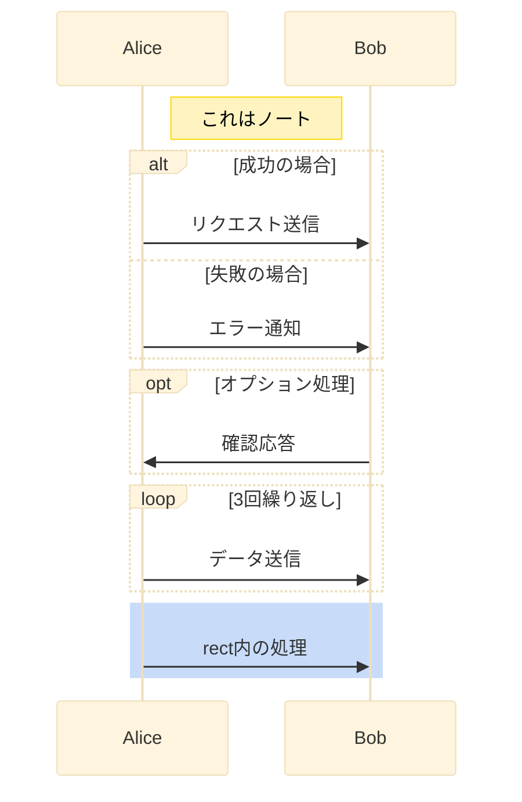

# VIAについて

## 目的
このページでは、Android における 音声操作アプリ(Voice Interaction Application。以降はVIAで記載)の考え方、構成、アプリ間連携、ルールを明確にする。

## VIAの考え方
Android では、音声操作アプリ（我々でいうところの音認アプリや音認サービス）に対する作成のお作法・テンプレートのクラスやインターフェースが用意されている。

### VIAのお作法

