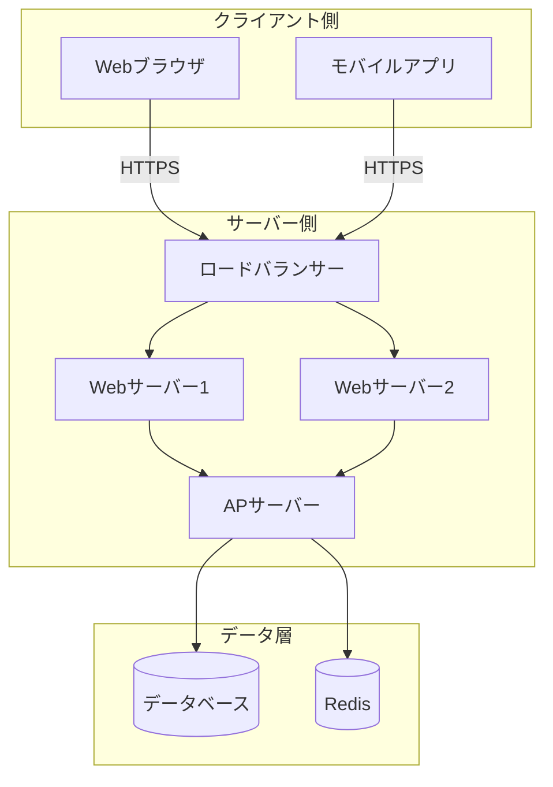

```mermaid
flowchart TB
    subgraph クライアント側
        WEB[Webブラウザ]
        APP[モバイルアプリ]
    end
    
    subgraph サーバー側
        LB[ロードバランサー]
        WEB1[Webサーバー1]
        WEB2[Webサーバー2]
        AP[APサーバー]
    end
    
    subgraph データ層
        DB[(データベース)]
        CACHE[(Redis)]
    end

    WEB -->|HTTPS| LB
    APP -->|HTTPS| LB
    LB --> WEB1
    LB --> WEB2
    WEB1 --> AP
    WEB2 --> AP
    AP --> DB
    AP --> CACHE

    
```