# gRPCの詳細とREST APIとの比較

## 1. gRPCのバイナリフォーマット

### 1.1 Protocol Buffersの基本構造

```
フィールドエンコーディング:
┌─────────────┬──────────────────┬─────────────┐
│   Key       │   Value          │  次のフィールド │
│ (field+type)│   (データ)        │              │
└─────────────┴──────────────────┴─────────────┘

Key = (field_number << 3) | wire_type
```

### 1.2 Wire Type（データ型）

| Wire Type | 値 | 用途 | 例 |
|-----------|---|------|-----|
| Varint | 0 | int32, int64, bool | `08 96 01` |
| 64-bit | 1 | fixed64, double | 8バイト固定 |
| Length-delimited | 2 | string, bytes, message | `12 03 42 6F 62` |
| 32-bit | 5 | fixed32, float | 4バイト固定 |

### 1.3 実例：ユーザーデータ

```protobuf
message User {
  int32 id = 1;        // フィールド番号1
  string name = 2;     // フィールド番号2
  bool active = 3;     // フィールド番号3
}
```

**データ例:**
```
User {
  id: 150
  name: "Bob"
  active: true
}
```

**バイナリエンコーディング:**
```
┌─────────────────────────────────────────┐
│ 08 96 01                                │  フィールド1: id=150
│ ├─ 08: Key (1<<3|0) = フィールド1, Varint│
│ └─ 96 01: 150 (Varint)                  │
├─────────────────────────────────────────┤
│ 12 03 42 6F 62                          │  フィールド2: name="Bob"
│ ├─ 12: Key (2<<3|2) = フィールド2, String│
│ ├─ 03: 長さ3バイト                       │
│ └─ 42 6F 62: "Bob" (UTF-8)              │
├─────────────────────────────────────────┤
│ 18 01                                   │  フィールド3: active=true
│ ├─ 18: Key (3<<3|0) = フィールド3, Varint│
│ └─ 01: true                             │
└─────────────────────────────────────────┘

合計: 11バイト
```

**JSON比較:**
```json
{"id":150,"name":"Bob","active":true}
```
```
合計: 37バイト（3.4倍）
```

### 1.4 Varint詳細

```
数値 150 のエンコード:

10進数: 150
2進数:  00000000 10010110

ステップ1: 7ビットずつ分割（リトルエンディアン）
  0010110  0000001
  (下位)    (上位)

ステップ2: MSB（継続ビット）追加
  1 0010110  0 0000001
  ↑継続あり  ↑最終バイト

結果: 0x96 0x01

┌──────────┬──────────┐
│ 10010110 │ 00000001 │
│  (0x96)  │  (0x01)  │
└──────────┴──────────┘
```

### 1.5 gRPCフレームフォーマット

```
gRPCメッセージ全体の構造:

┌─────────────────┬────────────────┬─────────────────────┐
│ Compressed Flag │ Message Length │ Protobuf Message    │
│    (1 byte)     │   (4 bytes)    │     (N bytes)       │
└─────────────────┴────────────────┴─────────────────────┘

例: User { id: 150, name: "Bob", active: true }

┌────┬─────────────────┬────────────────────────────┐
│ 00 │ 00 00 00 0B     │ 08 96 01 12 03 42 6F 62 18 01 │
│    │                 │                            │
│非圧縮│ 11バイト(BigE) │ Protobufデータ(11バイト)   │
└────┴─────────────────┴────────────────────────────┘

合計: 16バイト
```

### 1.6 サイズ比較表

| データ | Protobuf | JSON | XML | 削減率 |
|--------|----------|------|-----|--------|
| User(上記) | 11 B | 37 B | 85 B | 70% |
| int32: 1 | 2 B | 8 B | 20 B | 75% |
| string: "Hello" | 7 B | 9 B | 25 B | 22% |
| 複雑なオブジェクト | 82 B | 220 B | 450 B | 63% |

## 2. gRPC通信シーケンス

### 2.1 初回接続とUnary RPC

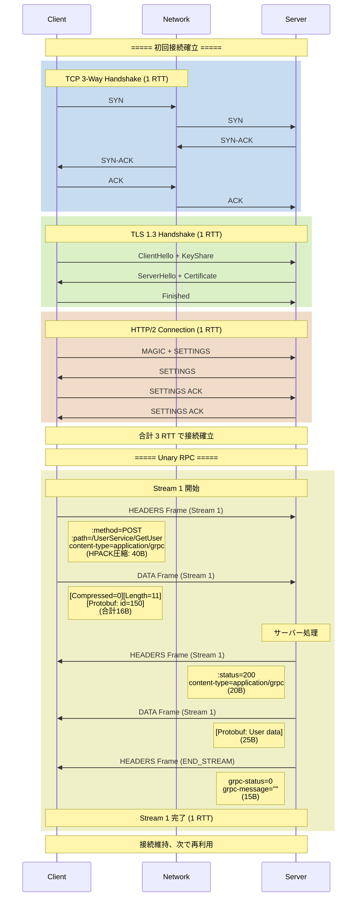

### 2.2 複数メッセージの多重化

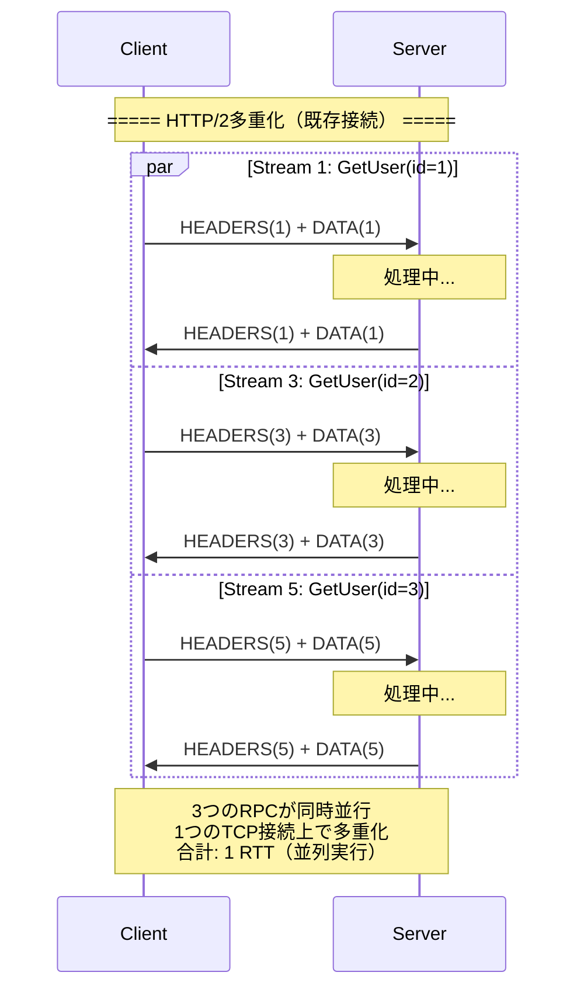

### 2.3 Server Streaming RPC

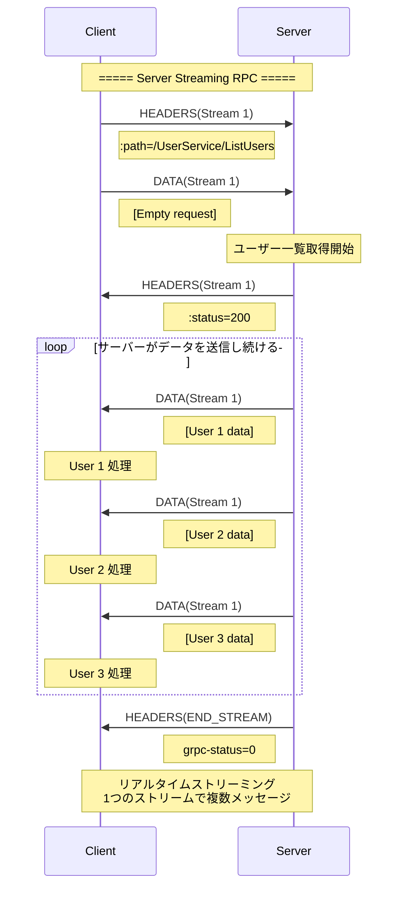

### 2.4 Bidirectional Streaming RPC

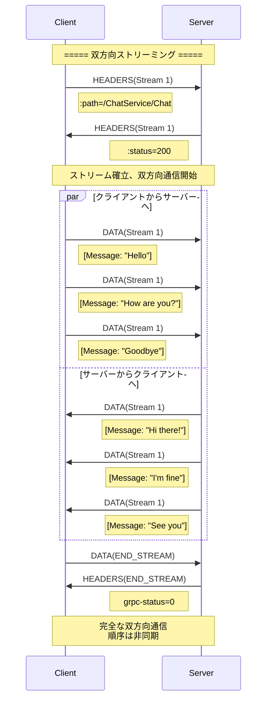

## 3. REST API通信シーケンス

### 3.1 初回接続とリクエスト（Keep-Alive）

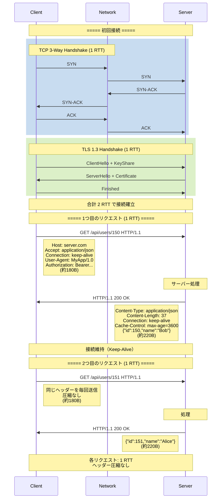

### 3.2 複数リクエスト（直列処理）

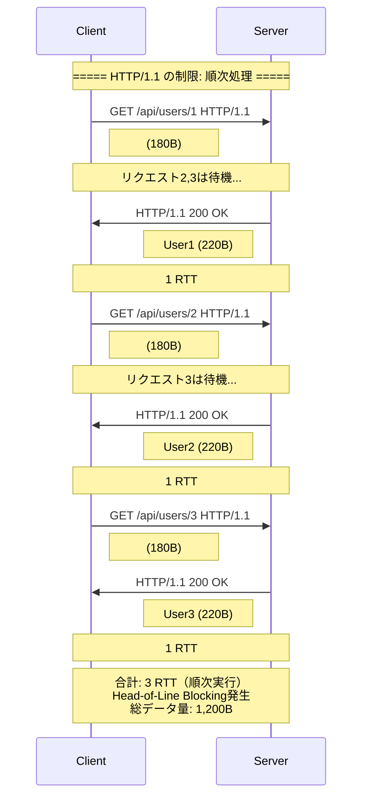

### 3.3 接続都度確立（最悪パターン）

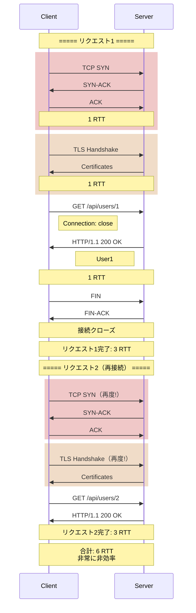

### 3.4 RESTful CRUD操作

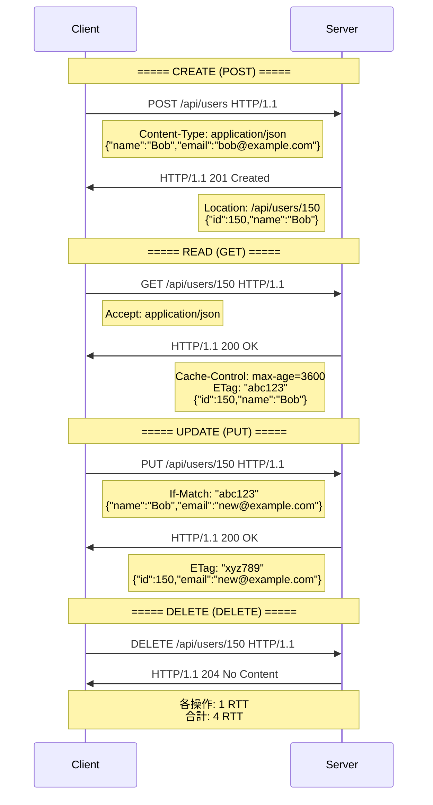

## 4. gRPC vs REST 詳細比較

### 4.1 データ量比較

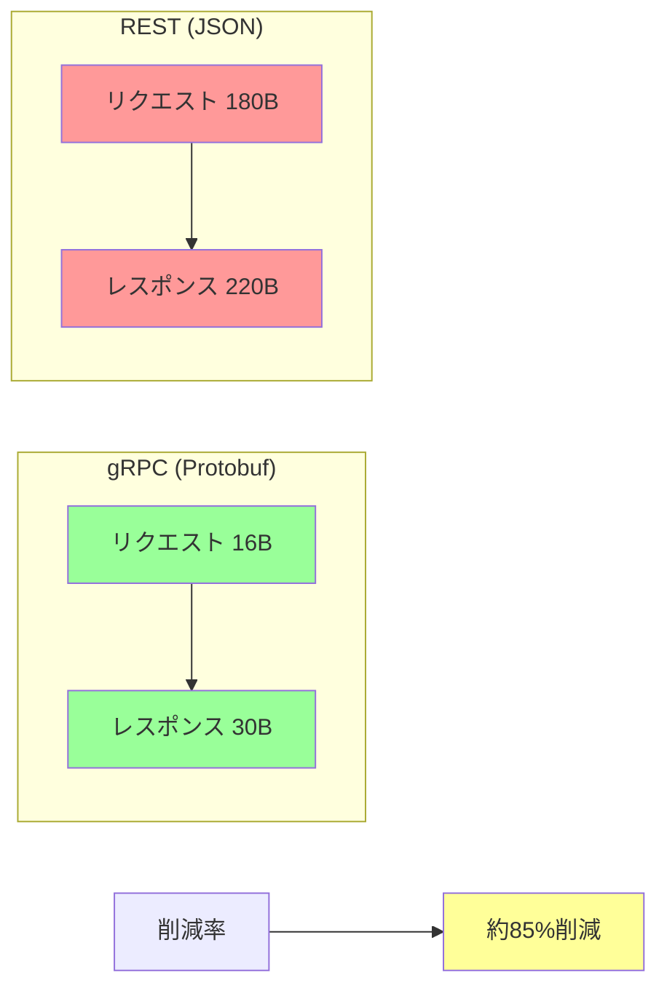

### 4.2 接続確立の違い

```mermaid
gantt
    title 初回接続までの時間 (RTT = 50ms)
    dateFormat X
    axisFormat %L ms
    
    section gRPC
    TCP Handshake :0, 50
    TLS Handshake :50, 100
    HTTP/2 Setup :100, 150
    
    section REST
    TCP Handshake :0, 50
    TLS Handshake :50, 100
```

### 4.3 複数リクエストの効率

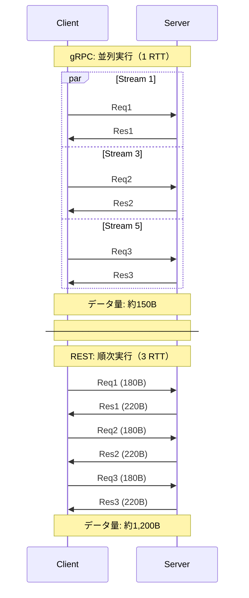

### 4.4 ストリーミングの違い

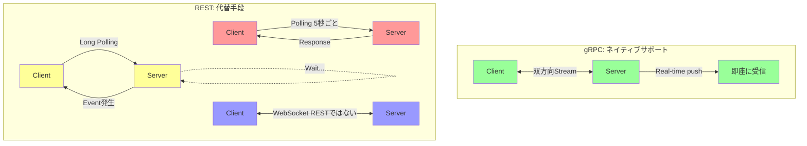

## 5. 性能比較サマリー

### 5.1 レイテンシ比較（RTT = 50ms）

```mermaid
gantt
    title 5メッセージ送信の総時間
    dateFormat X
    axisFormat %L ms
    
    section gRPC
    接続確立 (3 RTT) :0, 150
    メッセージ5件 (1 RTT) :150, 200
    
    section REST (Keep-Alive)
    接続確立 (2 RTT) :0, 100
    メッセージ5件 (5 RTT) :100, 350
    
    section REST (都度接続)
    メッセージ1 (3 RTT) :0, 150
    メッセージ2 (3 RTT) :150, 300
    メッセージ3 (3 RTT) :300, 450
    メッセージ4 (3 RTT) :450, 600
    メッセージ5 (3 RTT) :600, 750
```

### 5.2 データ転送量比較

| 項目 | gRPC | REST | 差 |
|------|------|------|-----|
| **初回接続** | 約200B | 約150B | +33% |
| **1リクエスト** | 約50B | 約400B | -87% |
| **5リクエスト** | 約450B | 約2,150B | -79% |
| **ヘッダー圧縮** | HPACK (85%削減) | なし | - |
| **ボディ圧縮** | Protobuf (60%削減) | JSON | - |

### 5.3 機能比較

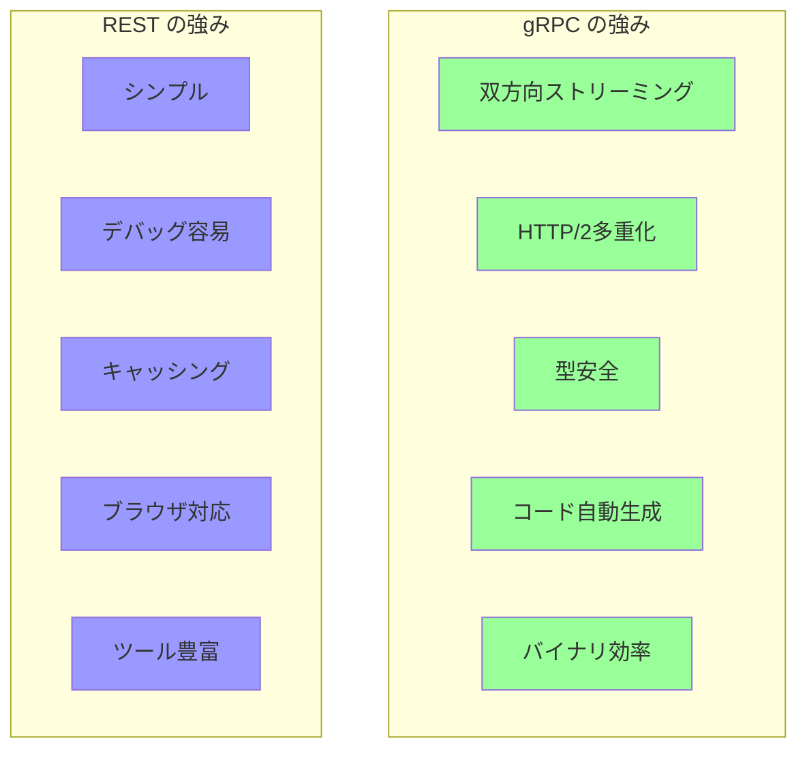

## 6. まとめ

### 6.1 選択基準

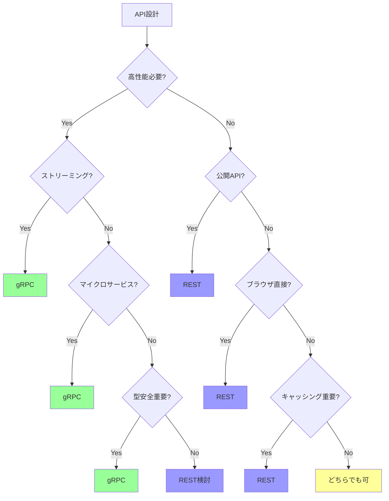

### 6.2 パフォーマンス要約

**gRPCが優れる点:**
- ✅ データサイズ: 約80%削減
- ✅ レイテンシ: 複数リクエストで3-5倍高速
- ✅ 並列処理: HTTP/2多重化
- ✅ ストリーミング: ネイティブサポート

**RESTが優れる点:**
- ✅ シンプルさ: curl でテスト可能
- ✅ デバッグ: 人間可読
- ✅ キャッシング: HTTP標準機構
- ✅ エコシステム: ツール・ドキュメント豊富

**推奨:**
- **内部マイクロサービス**: gRPC
- **公開Web API**: REST
- **モバイル⇔バックエンド**: gRPC
- **ブラウザ⇔サーバー**: REST (またはgRPC-Web)