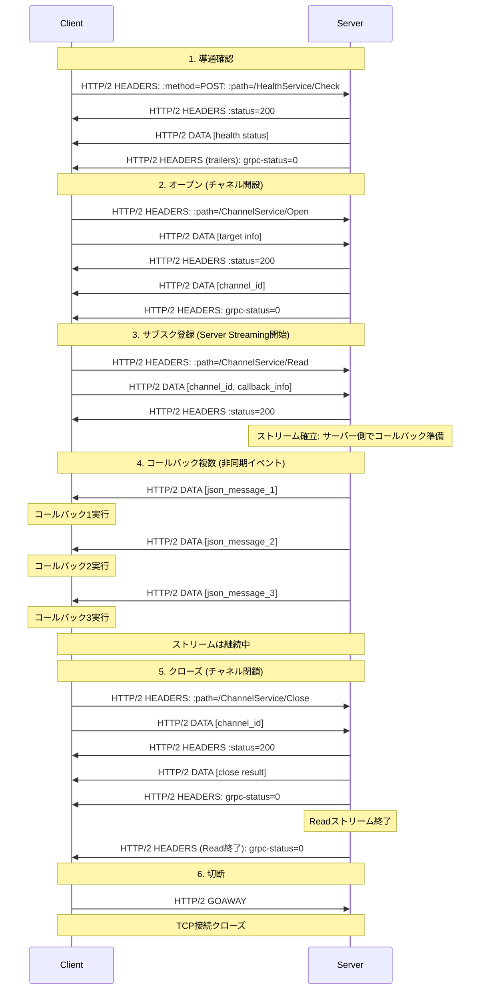
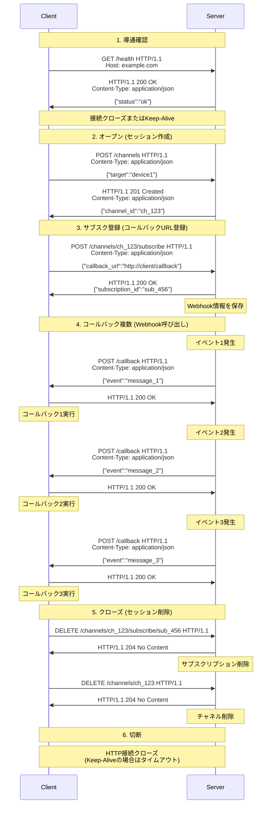

# タイトル
## サブタイトル1
通信パターン
gRPCは4つの通信パターンをサポートしています：

Unary RPC - 単純なリクエスト/レスポンス
Server streaming - クライアントが1つのリクエストを送り、サーバーからストリームでレスポンスを受け取る
Client streaming - クライアントがストリームでリクエストを送り、サーバーが1つのレスポンスを返す
Bidirectional streaming - 双方向でストリームを送受信

