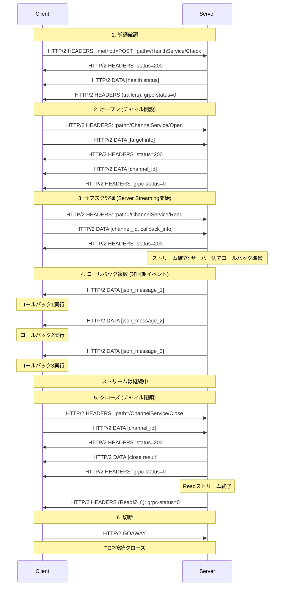
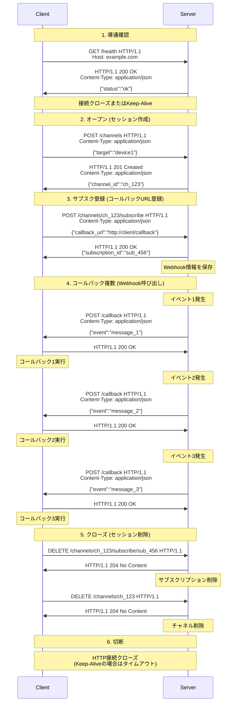
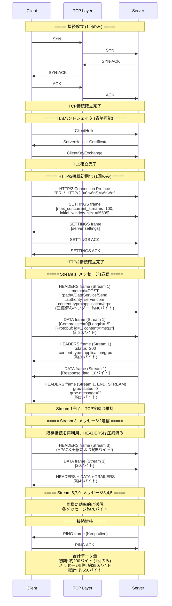
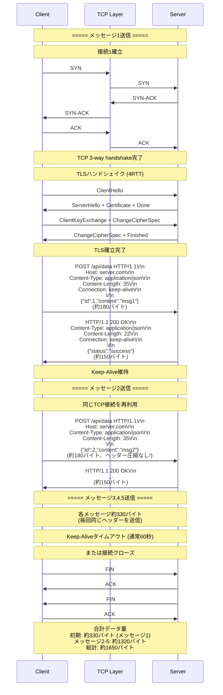
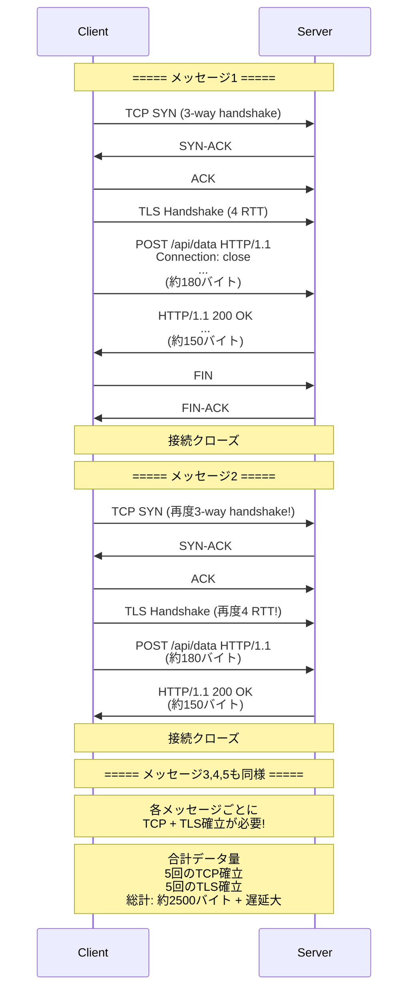
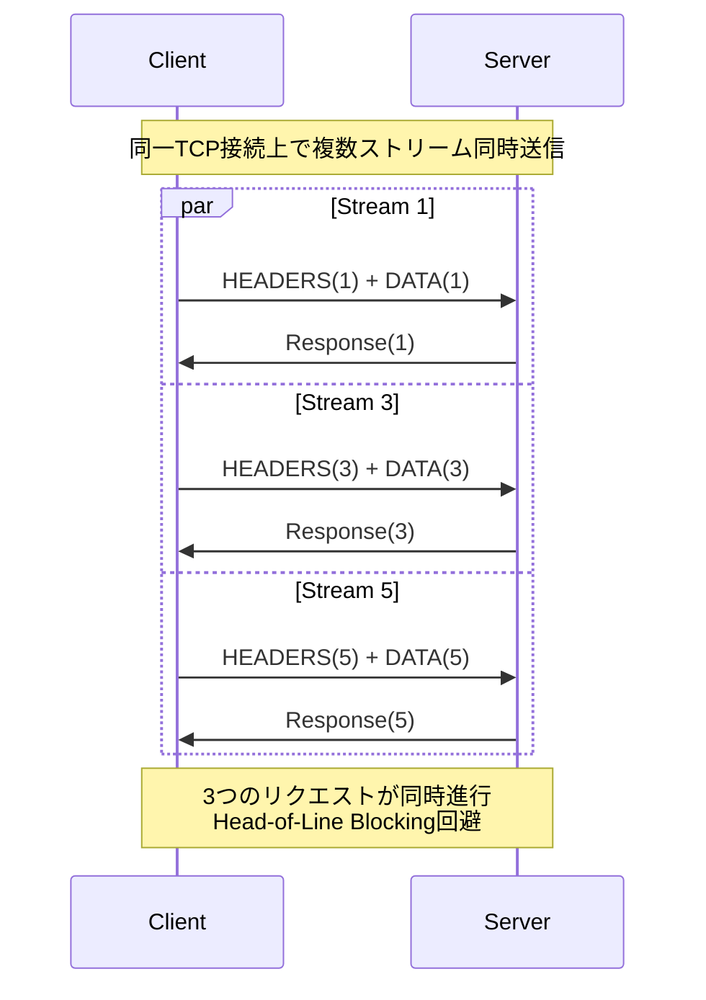
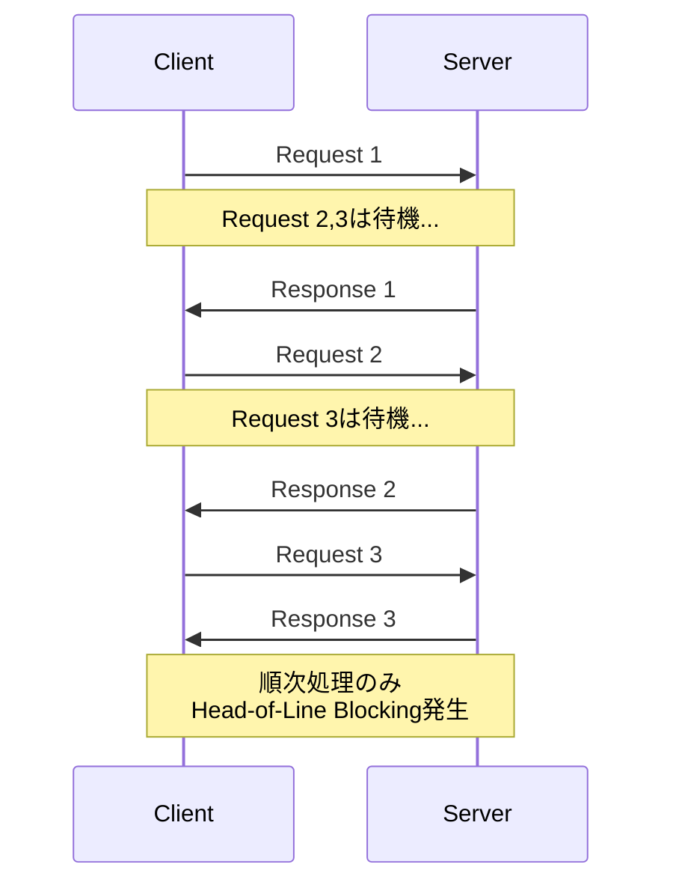

# タイトル
## サブタイトル1
通信パターン
gRPCは4つの通信パターンをサポートしています：

Unary RPC - 単純なリクエスト/レスポンス
Server streaming - クライアントが1つのリクエストを送り、サーバーからストリームでレスポンスを受け取る
Client streaming - クライアントがストリームでリクエストを送り、サーバーが1つのレスポンスを返す
Bidirectional streaming - 双方向でストリームを送受信







## gRPCのバイナリフォーマット
gRPCで使用されるProtocol Buffersのバイナリエンコーディングについて詳しく説明します。
Protocol Buffersの基本エンコーディング
Wireタイプ
Protocol Buffersでは、各フィールドは「フィールド番号」と「Wireタイプ」でエンコードされます。
Wireタイプ値用途Varint0int32, int64, uint32, uint64, sint32, sint64, bool, enum64-bit1fixed64, sfixed64, doubleLength-delimited2string, bytes, embedded messages, repeated fields32-bit5fixed32, sfixed32, float
キーのエンコーディング
各フィールドは**キー（Tag）**で始まります：
キー = (フィールド番号 << 3) | Wireタイプ
例：
```
フィールド番号1、Wireタイプ0（Varint） → 0x08 (1 << 3 | 0 = 8)
フィールド番号2、Wireタイプ2（Length-delimited） → 0x12 (2 << 3 | 2 = 18)

Varintエンコーディング
Varintは可変長整数エンコーディングです。小さい数値ほど少ないバイトで表現されます。
エンコーディングルール

各バイトの最上位ビット（MSB）が継続フラグ
MSB=1: 次のバイトも続く
MSB=0: 最後のバイト
下位7ビットがデータ

例：数値150のエンコード
150 = 10010110 (2進数)

ステップ1: 7ビットずつ分割
  0000001 0010110

ステップ2: リトルエンディアンで並べる
  0010110 0000001

ステップ3: MSBを付ける
  10010110 00000001

結果: 0x96 0x01
数値    バイナリ           エンコード結果
0       00000000          0x00
1       00000001          0x01
127     01111111          0x7F
128     10000000          0x80 0x01
150     10010110          0x96 0x01
300     100101100         0xAC 0x02
実際のメッセージ例
protoファイル定義
protobuf
message Person {
  int32 id = 1;        // フィールド番号1
  string name = 2;     // フィールド番号2
  bool active = 3;     // フィールド番号3
  repeated int32 scores = 4;  // フィールド番号4
}
```

### エンコード例1：基本データ
```
Person {
  id: 150
  name: "Bob"
  active: true
}
```

**バイナリ表現：**
```
08 96 01          # フィールド1: id=150
                  # 08 = (1<<3|0) キー
                  # 96 01 = 150 (Varint)

12 03 42 6F 62    # フィールド2: name="Bob"
                  # 12 = (2<<3|2) キー
                  # 03 = 長さ3
                  # 42 6F 62 = "Bob" (UTF-8)

18 01             # フィールド3: active=true
                  # 18 = (3<<3|0) キー
                  # 01 = true

合計：11バイト

JSON比較：
json{"id":150,"name":"Bob","active":true}
JSONは37バイト（約3.4倍）
エンコード例2：ネストされたメッセージ
protobuf
message Address {
  string city = 1;
  int32 zip = 2;
}

message Person {
  string name = 1;
  Address address = 2;
}

Person {
  name: "Alice"
  address: {
    city: "Tokyo"
    zip: 1000001
  }
}
```

**バイナリ表現：**
```
0A 05 41 6C 69 63 65    # フィールド1: name="Alice"
                         # 0A = (1<<3|2) キー
                         # 05 = 長さ5
                         # 41 6C 69 63 65 = "Alice"

12 0C                    # フィールド2: address (Length-delimited)
                         # 12 = (2<<3|2) キー
                         # 0C = 長さ12 (埋め込みメッセージのサイズ)
  
  # 埋め込みメッセージAddress:
  0A 05 54 6F 6B 79 6F   # city="Tokyo"
                         # 0A = (1<<3|2)
                         # 05 = 長さ5
                         # 54 6F 6B 79 6F = "Tokyo"
  
  10 81 84 3D            # zip=1000001
                         # 10 = (2<<3|0)
                         # 81 84 3D = 1000001 (Varint)
```

### エンコード例3：repeated（配列）
```
Person {
  scores: [85, 90, 78]
}
```

**方式1：個別エンコード**
```
20 55    # scores[0]=85  (0x20 = 4<<3|0)
20 5A    # scores[1]=90
20 4E    # scores[2]=78
```

**方式2：パックドエンコード（効率的）**
```
22 03 55 5A 4E    # packed repeated
                  # 22 = (4<<3|2) Length-delimited
                  # 03 = 長さ3バイト
                  # 55 5A 4E = [85, 90, 78]
```

## gRPCフレームフォーマット

gRPCでは、Protocol Buffersメッセージを以下の形式でラップします：
```
+------------------+------------------+------------------+
| Compressed-Flag  | Message-Length   | Message-Data     |
| (1 byte)         | (4 bytes)        | (N bytes)        |
+------------------+------------------+------------------+
```

### 例：Personメッセージの送信
```
Person { id: 150, name: "Bob", active: true }
のProtobuf = 08 96 01 12 03 42 6F 62 18 01 (11バイト)
```

**gRPCフレーム：**
```
00                    # 圧縮なし
00 00 00 0B           # メッセージ長=11 (ビッグエンディアン)
08 96 01 12 03 42 6F 62 18 01   # Protobufデータ
```

**合計：16バイト**

### ストリーミング時の複数メッセージ
```
[フレーム1: Message 1]
00 00 00 00 0B [11 bytes data]

[フレーム2: Message 2]
00 00 00 00 08 [8 bytes data]

[フレーム3: Message 3]
00 00 00 00 0F [15 bytes data]
```

各メッセージは独立したフレームとして送信されます。

## 特殊なデータ型

### sint32/sint64（ZigZag符号化）

負の数を効率的にエンコードするため、ZigZag符号化を使用：
```
符号付き値  ZigZag値  バイナリ
0          0         0x00
-1         1         0x01
1          2         0x02
-2         3         0x03
2          4         0x04

変換式：
ZigZag(n) = (n << 1) ^ (n >> 31)  // 32bit
ZigZag(n) = (n << 1) ^ (n >> 63)  // 64bit
```

### fixed32/fixed64（固定長）

常に4バイトまたは8バイトを使用（リトルエンディアン）：
```
fixed32: 0x12345678
→ 78 56 34 12

fixed64: 0x0123456789ABCDEF
→ EF CD AB 89 67 45 23 01
大きな数値が多い場合、Varintより効率的です。
実践的なサイズ比較
MCPプロトコル風のJSONメッセージ
JSON形式：
json{
  "jsonrpc": "2.0",
  "method": "notifications/message",
  "params": {
    "level": "info",
    "message": "Connection established"
  }
}
サイズ：約130バイト
Protocol Buffers定義：
protobufmessage McpMessage {
  string jsonrpc = 1;
  string method = 2;
  Params params = 3;
  
  message Params {
    string level = 1;
    string message = 2;
  }
}
```

**バイナリエンコード：**
```
0A 03 32 2E 30                    # jsonrpc="2.0" (5バイト)
12 16 6E 6F 74 69 66 69 63 61 74  # method="notifications/message" (24バイト)
69 6F 6E 73 2F 6D 65 73 73 61 67 65
1A 23                              # params (Length-delimited)
  0A 04 69 6E 66 6F                # level="info" (6バイト)
  12 1B 43 6F 6E 6E 65 63 74 69 6F  # message="Connection established" (29バイト)
  6E 20 65 73 74 61 62 6C 69 73 68
  65 64
合計：約65バイト（JSON比で50%削減）
デコード手順（C++実装イメージ）
cpp// バイナリからProtobufメッセージをデコード
bool DecodeMessage(const uint8_t* data, size_t size) {
    size_t pos = 0;
    
    while (pos < size) {
        // キーを読む
        uint32_t key;
        pos += DecodeVarint(data + pos, &key);
        
        uint32_t field_number = key >> 3;
        uint32_t wire_type = key & 0x07;
        
        switch (wire_type) {
            case 0: {  // Varint
                uint64_t value;
                pos += DecodeVarint(data + pos, &value);
                // field_numberに応じて値を格納
                break;
            }
            case 2: {  // Length-delimited
                uint32_t length;
                pos += DecodeVarint(data + pos, &length);
                // data[pos]からlengthバイト読む
                pos += length;
                break;
            }
            // 他のwire_typeも同様
        }
    }
    return true;
}
```
このバイナリフォーマットにより、gRPCは高速かつ省メモリで通信できます。特に埋め込みシステムでは、この効率性が重要になります。


## gRPCとRESTの通信効率比較：詳細シーケンス
両者の「本当の違い」を理解するため、TCP/IPレイヤーまで含めた詳細なシーケンスを比較します。
シナリオ：5件のメッセージを順次送信
protobuf// 各メッセージ
message Data {
  int32 id = 1;
  string content = 2;
}
gRPC (HTTP/2) の詳細シーケンス

REST (HTTP/1.1) の詳細シーケンス

REST (HTTP/1.1 Keep-Aliveなし) の場合


## バイト単位の詳細比較

### gRPC (HTTP/2) - 5メッセージ送信
```
=== 初期化 (1回のみ) ===
TCP 3-way handshake:     20バイト (SYN/ACK制御)
TLS handshake:           ~500バイト (証明書含む)
HTTP/2 Connection:       ~100バイト (SETTINGS等)
---
初期化合計:              ~620バイト

=== メッセージ1 ===
HEADERS (未圧縮):        40バイト
  :method: POST (インデックス化)
  :path: /DataService/Send
  :authority: server.com
  content-type: application/grpc

DATA:                    20バイト
  [0x00][0x00 0x00 0x00 0x0F]  # 5バイトヘッダー
  [id=1, content="msg1"]       # 15バイトProtobuf

Response HEADERS:        20バイト
Response DATA:           15バイト
Response TRAILERS:       15バイト
---
メッセージ1小計:         110バイト

=== メッセージ2-5 (HPACK圧縮効果) ===
HEADERS (HPACK圧縮):     5バイト!
  # 前回と同じヘッダーは索引参照のみ
  # 例: 0x82 = :method POST (静的テーブル参照)

DATA:                    20バイト
Response:                50バイト
---
メッセージ2-5小計:       75バイト × 4 = 300バイト

=== gRPC総計 ===
初期化:                  620バイト (1回のみ)
メッセージ:              410バイト (5件)
---
総計:                    1030バイト
```

### REST (HTTP/1.1 Keep-Alive) - 5メッセージ送信
```
=== 初期化 ===
TCP 3-way handshake:     20バイト
TLS handshake:           ~500バイト
---
初期化合計:              ~520バイト

=== メッセージ1 ===
Request:
POST /api/data HTTP/1.1\r\n              # 24バイト
Host: server.com\r\n                     # 18バイト
Content-Type: application/json\r\n      # 33バイト
Content-Length: 35\r\n                   # 20バイト
Connection: keep-alive\r\n               # 24バイト
User-Agent: ...\r\n                      # 30バイト
Accept: */*\r\n                          # 13バイト
\r\n                                     # 2バイト
{"id":1,"content":"msg1"}                # 35バイト (JSON)
---
Request小計:             199バイト

Response:
HTTP/1.1 200 OK\r\n                      # 17バイト
Content-Type: application/json\r\n      # 33バイト
Content-Length: 22\r\n                   # 20バイト
Connection: keep-alive\r\n               # 24バイト
Date: ...\r\n                            # 37バイト
Server: nginx\r\n                        # 15バイト
\r\n                                     # 2バイト
{"status":"success"}                     # 22バイト
---
Response小計:            170バイト

メッセージ1小計:         369バイト

=== メッセージ2-5 (圧縮なし!) ===
各メッセージ:            369バイト × 4 = 1476バイト
# ヘッダーは毎回同じ内容を送信!

=== REST総計 ===
初期化:                  520バイト
メッセージ:              1845バイト (5件)
---
総計:                    2365バイト
```

### REST (HTTP/1.1 接続都度確立) - 5メッセージ送信
```
=== 各メッセージごと ===
TCP handshake:           20バイト × 5 = 100バイト
TLS handshake:           500バイト × 5 = 2500バイト
HTTP Request/Response:   369バイト × 5 = 1845バイト
TCP teardown:            20バイト × 5 = 100バイト
---
総計:                    4545バイト
```

## レイテンシ（遅延）比較

### gRPC (HTTP/2)
```
初回接続:
  TCP handshake:         1 RTT
  TLS handshake:         2-3 RTT (TLS 1.3の場合)
  HTTP/2 SETTINGS:       1 RTT
  ---
  初回合計:              4-5 RTT

メッセージ送信 (2回目以降):
  データ送信→応答:       1 RTT
  
5メッセージ合計:         9-10 RTT
```

### REST (Keep-Alive)
```
初回接続:
  TCP handshake:         1 RTT
  TLS handshake:         2-3 RTT
  ---
  初回合計:              3-4 RTT

各メッセージ送信:
  リクエスト→レスポンス:  1 RTT × 5
  
5メッセージ合計:         8-9 RTT
```

### REST (接続都度確立)
```
各メッセージごと:
  TCP handshake:         1 RTT
  TLS handshake:         2-3 RTT
  リクエスト→レスポンス:  1 RTT
  ---
  1メッセージ:           4-5 RTT
  
5メッセージ合計:         20-25 RTT (!!)
HTTP/2の多重化効果
gRPC: 並列送信可能
```

REST (HTTP/1.1): 直列処理

実測値の例（100メッセージ送信）
項目gRPC (HTTP/2)REST (Keep-Alive)REST (都度接続)総データ量~15KB~35KB~450KB総RTT数~105~103~400実時間 (50ms RTT)~5.25秒~5.15秒~20秒実時間 (200ms RTT)~21秒~20.6秒~80秒CPU使用率低 (バイナリ)中 (JSON)高 (接続確立)メモリ使用量少 (接続1本)中 (接続1本)多 (接続100本)
結論：なぜgRPCが効率的か

接続の再利用: HTTP/2で1本のTCP接続を維持
ヘッダー圧縮: HPACK により2回目以降のヘッダーが数バイト
バイナリプロトコル: Protocol BuffersでJSONの約50%サイズ
多重化: 複数リクエストを並列処理、待ち時間なし
フロー制御: ウィンドウサイズ管理で効率的なデータ転送


