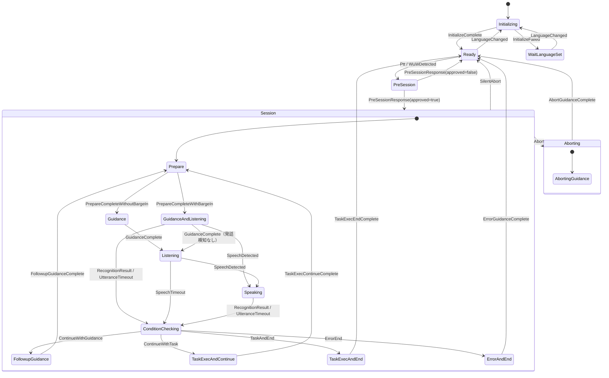
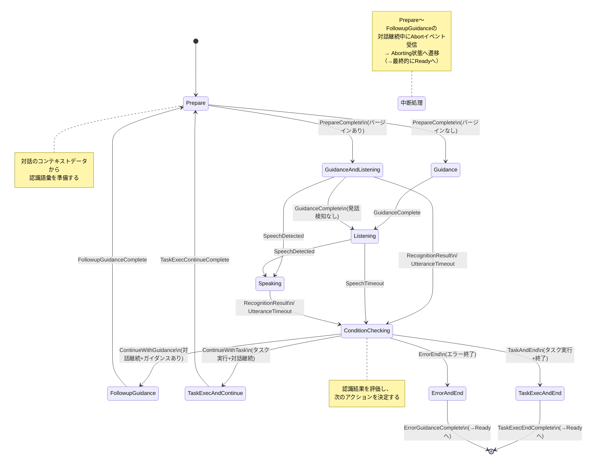
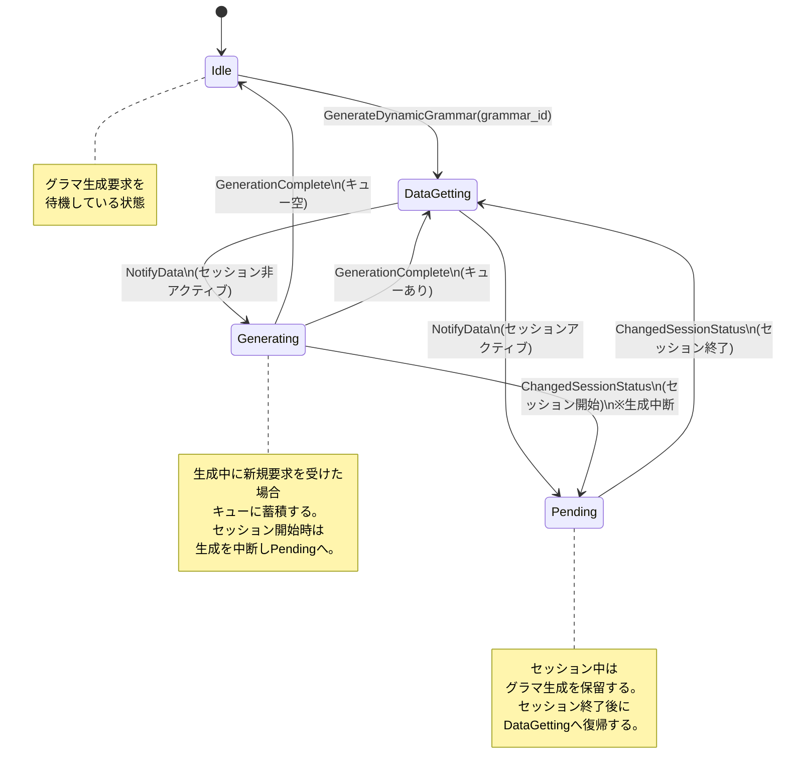
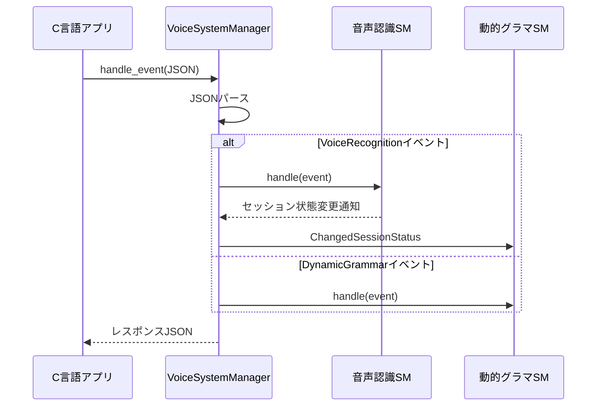

# 音声認識システム 状態遷移図

## 1. 音声認識メイン状態遷移図



### 状態の説明

| 状態 | 説明 |
|------|------|
| **Initializing** | システム初期化中。初期化完了でReadyへ、失敗でWaitLanguageSetへ遷移する。 |
| **WaitLanguageSet** | 初期化失敗後、次の言語設定を待つ状態。LanguageChangedイベントで再度Initializingへ戻る。 |
| **Ready** | PTT（Push-to-Talk）またはWuW（Wake-up Word）による音声認識開始を受け付ける待機状態。 |
| **PreSession** | 音声認識開始の可否を上位システムに問い合わせて応答を待つ状態。承認されればSessionへ、拒否されればReadyに戻る。 |
| **Session** | 音声認識セッション状態。内部にサブ状態を持ち、対話の繰り返しを行う。 |

### メインレベルイベント

| イベント | 説明 |
|---------|------|
| `InitializeComplete` | 初期化成功 |
| `InitializeFailed` | 初期化失敗 |
| `Ptt` | Push-to-Talkボタン押下 |
| `WuWDetected` | Wake-up Word検出 |
| `LanguageChanged` | 言語設定変更 |
| `PreSessionResponse` | PreSession問い合わせへの応答（approved: bool, context_data: Option） |

---

## 2. Session内サブ状態遷移図



### Session内サブ状態の説明

| サブ状態 | 説明 |
|---------|------|
| **Prepare** | コンテキストデータから認識語彙を読み出し、音声認識の準備を行う。バージイン設定に応じて次の遷移先が分岐する。 |
| **Guidance** | バージインなしの場合のガイダンス再生状態。ガイダンス完了後にListeningへ遷移する。 |
| **GuidanceAndListening** | バージインありの場合のガイダンス再生状態。ガイダンス再生と同時に音声認識を開始する。発話検知時はSpeakingへ、ガイダンス完了時（発話検知なし）はListeningへ遷移。 |
| **Listening** | 音声認識中（発話待ち）。発話検知でSpeakingへ、タイムアウトでConditionCheckingへ遷移する。 |
| **Speaking** | 発話検知後の音声認識中。認識結果またはタイムアウトでConditionCheckingへ遷移する。 |
| **ConditionChecking** | 認識結果を評価して次のアクションを決定する。対話継続（ガイダンスあり/タスク実行）、終了（タスク実行/エラー）の4パターンに分岐する。 |
| **FollowupGuidance** | 対話継続前のフォローアップガイダンスを再生する。完了後にPrepareへ戻る。 |
| **TaskExecAndContinue** | 音声認識結果に基づくタスクを実行し、対話を継続する。完了後にPrepareへ戻る。 |
| **TaskExecAndEnd** | 音声認識結果に基づくタスクを実行して終了する（機能実行終了）。完了後にReadyへ戻る。 |
| **ErrorAndEnd** | エラーガイダンスを再生して終了する（エラー終了）。完了後にReadyへ戻る。 |
| **Aborting** | 中断ガイダンスを再生して終了する（中断終了）。AbortイベントはSession superstateで処理されるため、対話中のどの状態からでも遷移可能。 |

### Sessionレベルイベント

| イベント | 説明 |
|---------|------|
| `Abort` | 中断要求。Session内のどの状態からでもAbortingへ遷移する。 |
| `SilentAbort` | サイレント中断。ガイダンスなしで即座にReadyへ戻る。 |
| `ItemSelected { context_id }` | アイテム選択（コンテキストID指定） |
| `Back { context_id }` | 戻る操作（コンテキストID指定） |

---

## 3. 動的グラマ生成状態遷移図



### 動的グラマ生成状態の説明

| 状態 | 説明 |
|------|------|
| **Idle** | グラマ生成が動いていない待機状態。GenerateDynamicGrammar要求を受けるとDataGettingへ遷移する。 |
| **DataGetting** | 動的グラマ生成に必要なデータを取得中。データ取得完了時、音声認識セッションの状態に応じてGeneratingまたはPendingへ遷移する。 |
| **Generating** | グラマ生成実行中。生成中に新規要求を受けた場合はキューに蓄積する。生成完了時はキューの状態に応じてIdleまたはDataGettingへ遷移する。セッション開始時は生成を中断し、要求をキューの先頭へ退避してPendingへ遷移する。 |
| **Pending** | グラマ生成保留中。音声認識セッションが終了するまで待機し、終了後にDataGettingへ遷移する。 |

### 動的グラマ生成イベント

| イベント | 説明 |
|---------|------|
| `GenerateDynamicGrammar { grammar_id }` | 指定IDのグラマ生成要求 |
| `ChangedSessionStatus { status_id }` | 音声認識SMのセッション状態変更通知。status_idは "Inactive", "InPreSession", "InSession" のいずれか。 |
| `NotifyData { data }` | データ取得完了通知 |
| `GenerationComplete` | グラマ生成完了通知 |
| `GenerationAborted` | グラマ生成中断完了通知 |

---

## SM間の協調動作

音声認識SMと動的グラマ生成SMは `VoiceSystemManager` によって協調管理される。



### JSON入出力フォーマット

#### 入力（イベント）
```json
{
    "target": "VoiceRecognition",
    "event": {
        "type": "Ptt"
    }
}
```

```json
{
    "target": "VoiceRecognition",
    "event": {
        "type": "PreSessionResponse",
        "data": {
            "approved": true,
            "context_data": "context_json_string"
        }
    }
}
```

```json
{
    "target": "DynamicGrammar",
    "event": {
        "type": "GenerateDynamicGrammar",
        "data": {
            "grammar_id": "grammar_001"
        }
    }
}
```

#### 出力（レスポンス）
```json
{
    "success": true,
    "voice_recognition_state": "Ready",
    "dynamic_grammar_state": "Idle",
    "message": null
}
```

### FFI関数一覧

| 関数 | 説明 |
|------|------|
| `create_voice_system() -> *mut VoiceSystemHandle` | システム生成。戻り値のポインタはdestroy_voice_systemで解放する。 |
| `destroy_voice_system(handle)` | システム破棄。 |
| `handle_event(handle, json_ptr) -> *const c_char` | JSONイベントを処理し、結果をJSON文字列で返す。 |
| `get_current_state(handle) -> *const c_char` | 現在の状態をJSON文字列で返す。 |
